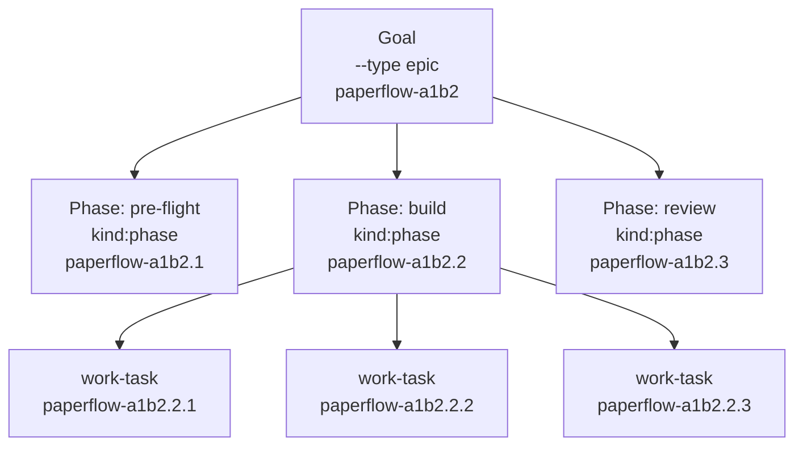
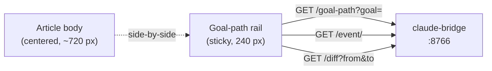
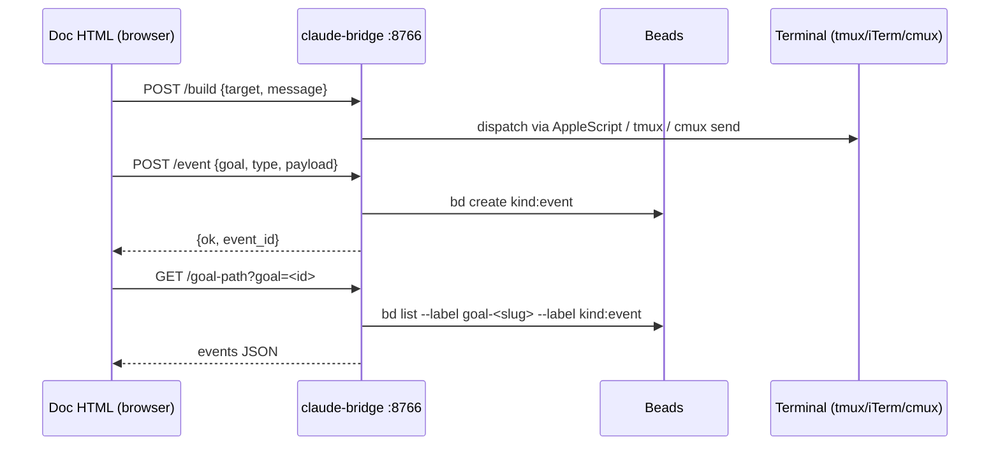

# paperflow — Architecture & internals

Reference manual for the engine. The [README](./README.md) is the front door; this is the wiring underneath. Read this if you're hacking on paperflow itself.

[Hierarchy](#hierarchy) · [Beads](#beads) · [Goal-path rail](#goal-path-rail) · [cmux Dock](#cmux-dock) · [Simplify pipeline](#simplify-pipeline) · [Subagent thresholds](#subagent-thresholds) · [Bridge HTTP endpoints](#bridge-http-endpoints) · [Live-render & doc.js](#live-render--docjs) · [Statusline](#statusline) · [Hooks](#hooks) · [Repo layout](#repo-layout) · [Skill authoring](#skill-authoring)

---

## Hierarchy

The hierarchy is **Goal → Phase → Task**, mapped 1:1 to Beads' native hierarchical IDs.



| Layer | Beads kind | Example ID | Lives at |
|---|---|---|---|
| Goal | `--type epic` (label: `kind:goal`) | `paperflow-a1b2` | top-level Beads task |
| Phase | `kind:phase` | `paperflow-a1b2.2` | child of the goal-task |
| Task | (work-task) | `paperflow-a1b2.2.3` | child of the phase-task |
| Event | `kind:event` | `paperflow-a1b2.evt` | sidecar history; hidden from default `bd list`/`bd ready` |

### Pointer files

Two pointer files in `<repo>/.paperflow/` say what's active in this checkout:

```
<repo>/.paperflow/active-goal     # one line: paperflow-a1b2
<repo>/.paperflow/active-phase    # one line: paperflow-a1b2.2
```

Lookup walks up from cwd to the nearest `.paperflow/`. With neither file present anywhere up to `/`, paperflow has no active goal/phase. Both pointers are written by `/paperflow:goal` (on open) and `/paperflow:resume` (on switch). `/paperflow:build` advances `active-phase` when the current phase empties.

A second mirror at `~/.paperflow/active-goal` exists for hooks that fire from `~/docs/paperflow/...` (where the dev repo isn't reachable up the directory tree).

### Per-instance scoping

paperflow's active goal is per-instance. Each Claude Code instance scopes its own `active-goal` and `active-phase` pointers — by cmux workspace id when running under cmux, by Claude Code session id otherwise. Two cmux workspaces can work on different Goals without colliding. All paperflow code reads/writes through the `paperflow-active-scope` helper:

```bash
paperflow-active-scope --read goal       # current scope's active goal
paperflow-active-scope --write goal <id> # set it
paperflow-active-scope --list-all        # see every scope's state
paperflow-active-scope --resolve         # debug: print current scope token
```

### Umbrella label

For multi-axis outcomes spanning more than one Goal, apply an optional `umbrella-<slug>` label — `/paperflow:resume` groups Goals by umbrella when one is present.

---

## Beads

paperflow uses Beads (`bd`) as the single source of truth for goals, phases, tasks, and events. No JSON sidecars, no parallel state. The DB lives at `~/.beads/beads.db` (default Beads location); paperflow does not bundle, redistribute, or modify Beads.

### Per-repo init

`paperflow-bd-init` runs `bd init` once on the first Goal in a repo. `/paperflow:build` claims with `bd update <id> --claim` and closes with `bd update <id> --close`. `bd ready --label goal-<slug> --label phase-<active>` returns the next ready work-task within the active phase.

### Goal-tasks: epics

Goal-tasks use Beads' native `--type epic`. `/paperflow:build` calls `bd epic close-eligible` at phase-empty to auto-close completed Goals. The user-facing word stays "Goal."

### Label conventions

| Label | Meaning |
|---|---|
| `kind:goal` | Goal-task. One per Goal. (Co-exists with `--type epic`.) |
| `kind:phase` | Phase-task. Three per default Goal (pre-flight, build, review). |
| `kind:event` | Sidecar event in the goal-path rail. Hidden from default `bd list`/`bd ready` via `~/.beads/aliases.toml` blocks the installer appends. |
| `goal-<slug>` | Every task descends a Goal — work-tasks, phase-tasks, events all carry this. |
| `phase-<name>` | Phase scoping — e.g. `phase-build`. Used by `bd ready --label`. |
| `branch:main` / `branch:alt-<n>` / `branch:simplified-<n>` | Branch markers on rail events. |
| `event:<name>` | The lifecycle event type (`event:goal-opened`, `event:plan-written`, etc.). |
| `source:<rel-path>` | Doc the event was emitted from; powers `?source=` lookup. |

To peek at events anyway: `bd list --label kind:event`. On Beads versions that don't honour the alias file, that flag is the documented fallback.

---

## Goal-path rail

Every paperflow doc loaded with an active Goal in scope renders a 240 px sticky right rail showing the Goal's lifecycle as a Mermaid `gitGraph`. The rail tracks **events**, not doc revisions: `goal-opened`, `questionnaire-written`, `questionnaire-answered`, `plan-written`, `plan-grilled`, `phase-advanced`, `goal-snapshot`, `goal-closed`, `simplified-*`. Events live as `kind:event` Beads tasks parented to the goal-task, with HTML payloads at `~/.paperflow/events/<event-task-id>.html`.



### Goal resolution — two paths

- `GET /goal-path?goal=<id>` — explicit, when the page sets `window.PAPERFLOW_GOAL_ID`.
- `GET /goal-path?source=<rel-path>` — fallback, walks events with `source:<rel-path>` and returns the latest one's goal id.

`GET /event/<id>` serves the sidecar payload. `GET /diff?from=<id>&to=<id>` returns a line-level diff via `lib/text-diff.js` (vendored — no CDN, no jsdiff).

### Walk-back

Click an older event in the rail; `lib/goal-path-rail.js` writes its id to `<repo>/.paperflow/active-event-base`. The next save reads the pointer, parents the new event there, and lands it on a fresh `branch:alt-<n>`. The hook clears the pointer afterwards. Shift-click two distinct nodes to open the diff modal.

### Cross-doc lineage

When a doc carries `<meta name="paperflow-spawned-from" content="<rel-path>">`, the rail shows `↳ from <basename>` at the top. One level only — no transitive chain.

### Per-page opt-out

```html
<script>window.PAPERFLOW_NO_RAIL = true;</script>
```

…before the `doc.js` include.

---

## cmux Dock

cmux exposes a right-side Dock; paperflow puts four live feeds in it, surfacing the orchestrator's working memory.

| Feed | What it shows |
|---|---|
| `active-context` | Active Goal, active Phase, currently claimed Task |
| `bd-ready` | Top of `bd ready --label phase-<active>` (priority + title) |
| `goal-path` | Recent `kind:event` rows for goal+phase, sorted desc |
| `auto-open-log` | Tail of `~/.paperflow/auto-open.log` |

### Daemon model

A single Node daemon (`~/.local/bin/paperflow-dock-daemon`, no deps) polls Beads on a 2 s internal cadence, caches the four feeds, and serves them on a UNIX socket at `~/.paperflow/dock.sock`. Each Dock pane runs `watch -n 5 paperflow-dock-feed <name>`; the client is ~15 LOC of bash that `nc -U`s the socket and prints. PID file at `~/.paperflow/dock-daemon.pid`.

### Config

Lives at `${XDG_CONFIG_HOME:-$HOME/.config}/cmux/dock.json`. Skip-on-existing default; `bash install.sh --reset-dock` overwrites (after backing up to `dock.json.bak.<ts>`).

### Debug

```bash
paperflow-dock-feed active-context        # query directly
cat ~/.paperflow/dock-daemon.pid          # PID file (0 bytes if down)
tail /tmp/paperflow-dock-daemon.log       # non-cmux stderr
kill $(cat ~/.paperflow/dock-daemon.pid)  # graceful shutdown
bash install.sh                           # respawns daemon
```

---

## Simplify pipeline

Every plan, spec, and grill HTML carries a **Simplify** button. One click runs a leaning-pass subagent against the doc; the candidate goes through a two-tier verification gate before it lands as a new event on `branch:simplified-<n>` in the goal-path rail. The original is always one click-jump away.

```mermaid
stateDiagram-v2
    [*] --> Click
    Click --> POST: /simplify {doc_path, goal_id}
    POST --> Lean: leaning-pass subagent
    Lean --> Struct: candidate produced
    Struct --> Verify: PASS (structural diff OK)
    Struct --> Fail: FAIL
    Verify --> Land: PASS (subagent verdict)
    Verify --> Fail: FAIL
    Land --> RailEvent: kind:event on branch:simplified-<n>
    RailEvent --> Accept: user clicks Accept
    RailEvent --> Reject: user clicks Reject
    Accept --> SourceWritten: /simplify/accept; relabel to branch:main
    Reject --> Closed: /simplify/reject (with reason)
    Fail --> Log: simplify-failures.log
    Log --> [*]
    SourceWritten --> [*]
    Closed --> [*]
```

### Never-worse guarantee

The structural gate enforces: Mermaid figures, H2 hierarchy, bound decisions, and outbound URLs must all survive.

| Trim categories (allowed) | Never cut |
|---|---|
| Verbose phrasing | Mermaid figures |
| Redundancy | H2 headings |
| Example bloat | Bound decisions |
| Low-signal sub-bullets | Outbound URLs |
| Hedging words | The ingress |

### Accept / Reject

When a `branch:simplified-*` node is selected on the rail, Accept calls `POST /simplify/accept` (bridge writes the simplified payload back to the source HTML and relabels the event to `branch:main`); Reject calls `POST /simplify/reject` with an optional reason. The source HTML on disk is unchanged until the user explicitly accepts.

Implementation lives in `/paperflow:plan` as a sub-action — no new skill, the 7/7 cap holds.

---

## Subagent thresholds

paperflow's orchestrator follows a hard subagent-dispatch rule with concrete numeric thresholds and a structured commit-message marker. The single source of truth lives at `lib/shared-thresholds.md`; each non-exempt skill carries an inlined copy refreshed on every `bash install.sh` run.

### Hard thresholds — above ANY of these, dispatch a subagent

- **> 30 LOC** of new code (across all files in one logical unit)
- **> 50 lines** of new prose / markdown
- **> 500 tokens** of raw tool output captured / synthesised

### Carve-outs

Bash glue ≤ 25 LOC stays inline; other languages hold the 30 LOC gate. Beads bookkeeping, pointer-file writes, single-line edits, and verbatim subagent output are exempt — see the full carve-out list in `lib/shared-thresholds.md`.

### Pre-write checkpoint

Before any inline `Write` / `Edit` over threshold, the orchestrator prints a one-line justification:

```
Doing inline because: <reason>. Above threshold would be <subagent-reason>.
```

### Verification subagent

When a build subagent returns more than 500 tokens of evidence, `/paperflow:build` dispatches a SECOND subagent — a verification-subagent — which returns `PASS:` / `FAIL:` only. The orchestrator never absorbs raw evidence.

### Commit-message marker

Any commit touching > 30 LOC includes a structured trailer:

```
Subagent-Run: <task-id>
```

`bin/paperflow-audit-orchestrator-budget` flags over-threshold commits that lack this trailer. `/paperflow:review` runs the audit on every review-task; the reviewer must justify or re-open.

---

## Bridge HTTP endpoints

`claude-bridge` is a tiny Node HTTP server on `localhost:8766`. Browser buttons POST `{target, message}` (or richer payloads) to one of the endpoints; the bridge dispatches into the originating terminal tab via tmux / iTerm2 / Apple Terminal / cmux.



| Endpoint | Method | Purpose | Request | Response |
|---|---|---|---|---|
| `/` | GET | Liveness ping | — | `claude-bridge ok` |
| `/build` | POST | Dispatch a message into the originating terminal | `{target, message}` | `{ok}` |
| `/marker` | POST | Questionnaire-answered sidecar; fires `event:questionnaire-answered` when active goal is known | `{target, message, goal_id?}` | `{ok}` |
| `/goal-path` | GET | Goal-path event subtree for the rail | `?goal=<id>` or `?source=<rel>` | `{events: [...]}` |
| `/event/<task-id>` | GET | Sidecar payload for one event-task | path param | HTML payload |
| `/event` | POST | Create a `kind:event` Beads task + sidecar | `{goal, type, branch?, payload}` | `{ok, event_id}` |
| `/event/active` | POST | Write `<repo>/.paperflow/active-event-base` (walk-back pointer) | `{event_id}` | `{ok}` |
| `/diff` | GET | Bridge-side line-level diff between two events | `?from=<id>&to=<id>` | `{diff: [...]}` |
| `/simplify` | POST | Kick off a leaning-pass + verification job | `{doc_path, goal_id}` | `{ok, job_id}` |
| `/simplify/status` | GET | Poll a Simplify job | `?job=<id>` | `{state, ...}` |
| `/simplify/accept` | POST | Promote a `simplified-<n>` event to `branch:main`, overwrite source HTML | `{event_id}` | `{ok}` |
| `/simplify/reject` | POST | Close a `simplified-<n>` event with a reason | `{event_id, reason?}` | `{ok}` |
| `/navigate` | POST | Open a paperflow URL via the auto-open contract | `{url}` | `{ok}` |

Targeting JSON is captured at write-time by `~/.local/bin/paperflow-target` and embedded in the doc as `window.CLAUDE_TARGET`.

When the bridge is launched outside a cmux pane, it loses cmux's socket trust — re-spawn via `cmux new-workspace --command "node ~/.local/lib/paperflow/claude-bridge.js"` if button clicks return broken-pipe.

---

## Live-render & doc.js

Specs, plans, grills, questionnaires, Goal HTML, and changelogs are standalone HTML articles — not Markdown. Article-style typography (eyebrow, ingress, byline, captioned figures, serif body, sans headings) lives in the shared stylesheet:

```html
<link rel="stylesheet" href="/paperflow/_lib/doc.css">
```

End every doc with:

```html
<script>
  window.CLAUDE_TARGET     = /* paste output of ~/.local/bin/paperflow-target */;
  window.DOC_PATH          = "<this-filename>.html";
  window.PAPERFLOW_GOAL_ID = "<goal-id>";   /* required for the rail */
</script>
<script src="/paperflow/_lib/doc.js"></script>
```

### Action button injection

`doc.js` reads the URL path and auto-injects the right buttons:

| URL contains | Primary button | Secondary |
|---|---|---|
| `/specs/` | Create plan from this spec | Grill the spec |
| `/plans/` | Build this plan | Grill the plan |
| `/grills/`, `/questionnaires/` | Submit (handled by `_lib/grill.js`) | — |
| `/goals/` | Snapshot, Archive | — |
| `/changelog/` | Share | — |

### Live-render

`docs-livereload` is a `live-server@1.2.2` LaunchAgent serving `~/docs/` on port 8765 with WebSocket hot reload (~200 ms refresh). Every paperflow HTML loads `live-render.js` via `doc.js`; on file change, the client morphs the DOM in-place — scroll position is preserved, rendered Mermaid diagrams survive.

Live-render short-circuits when `location.hostname` isn't `localhost` / `127.0.0.1` / `::1`, so printed PDFs, emailed copies, and USB exports never try to open a WebSocket they can't reach. Per-page opt-out:

```html
<script>window.PAPERFLOW_NO_LIVE_RENDER = true;</script>
```

…before the `doc.js` include. The version is pinned because newer pre-release builds have a known WebSocket-init regression that breaks the WS-intercept the live-render client relies on.

### Doc validation (mandatory)

A PostToolUse hook fires on Write/Edit of any HTML under `~/docs/paperflow/{specs,plans,grills,questionnaires,notes,changelog,goals,audits}/`, runs `paperflow-validate` (parses every Mermaid block — both `<pre class="mermaid">` and grill-style JS-literal `diagram:` strings), and surfaces failures as a `<system-reminder>`. Iterates up to 3 times.

---

## Statusline

When `<repo>/.paperflow/active-goal` exists, the bottom-bar statusline shows the goal slug, the active phase + position in the phase sequence, and the currently claimed Task with progress through the active phase:

```
137,420 / 1M · 1209d022 · onboarding-revamp · ▸ phase 2/3: build · ▸ paperflow-a1b2.2.3 wire-bridge · 4/9 · main
```

### Composition

`lib/statusline.sh` composes from a pre-rendered cache at `~/.paperflow/statusline.txt` (written by every Beads-mutating skill on claim/close); when stale, it falls through to live composition via `bd show / bd list --json`.

### Width-driven truncation

Drops phase first below 120 cols, then the task subsegments, then branch, project, session-id, in that order. Tokens always survive.

### Color thresholds

Token-percentage rendering uses thresholds defined in `lib/statusline-limits.json` (per-model context-window limits). To add a new model's limit, edit `~/.paperflow/statusline-limits.json` directly. The installer never overwrites a user-edited limits file — it tracks shipped versions via `~/.paperflow/.statusline-limits-installed-sha`.

### NO_COLOR & debug

Honours `NO_COLOR=1` for plain rendering. `STATUSLINE_DEBUG=1` mirrors every render to `~/.paperflow/statusline-debug.log` (rotates at 5 MB to `.log.1`).

---

## Hooks

Wired into `~/.claude/settings.json` by `install.sh`:

| Hook | Event | Purpose |
|---|---|---|
| `inject-principles.sh` | `UserPromptSubmit` | Re-inject standing principles every turn — bloat-resistant against context drift. |
| `auto-open-doc.sh` | `PostToolUse(Write\|Edit)` | Open any spec/plan/grill/note/Goal HTML you write. cmux de-dupes by URL: same URL refocuses the existing tab; different URL opens a new one. Logs to `~/.paperflow/auto-open.log`. |
| `validate-paperflow-doc.sh` | `PostToolUse(Write\|Edit)` | Run `paperflow-validate` on any paperflow doc HTML; surface Mermaid syntax errors as a `<system-reminder>` so Claude fixes them before reporting the URL. Iterates up to 3 times. |
| `event-on-save.sh` | `PostToolUse(Write\|Edit)` | Emit a `kind:event` Beads task + sidecar HTML when a paperflow doc is saved. Walks up to find the active Goal; falls back to the global `~/.paperflow/active-goal` mirror when the doc lives under `~/docs/paperflow/`. |

### Settings dedup

Hook dedup uses `--arg cmd` exact-path match (per `2026-05-07` change) — re-running `install.sh` will not append duplicate entries.

### Already-running sessions

In any **already-running** Claude Code session, run `/hooks` once after install (or restart) so hooks are picked up.

---

## Repo layout

```
paperflow/
├── README.md                       # front door
├── ARCHITECTURE.md                 # this file
├── INSTALL.md                      # install.sh details, manual install, uninstall
├── LICENSE                         # MIT
├── THIRD-PARTY-CREDITS.md          # obra/superpowers + Beads attribution
├── install.sh                      # idempotent installer
├── uninstall.sh                    # reverse it
├── claude-md.tmpl                  # template for ~/.claude/CLAUDE.md
├── claude-md-fragments/            # opt-in fragments
│   ├── browserbase.md
│   ├── openclaw.md
│   └── unlighthouse.md
├── bin/
│   ├── claude-bridge.js            # the bridge service
│   ├── get-terminal-target.sh      # captures CLAUDE_TARGET JSON
│   ├── paperflow-active-scope      # resolves goal/phase from cwd up
│   ├── paperflow-bd-init           # per-repo Beads bootstrap
│   ├── paperflow-validate          # static Mermaid check (~80 LOC Node)
│   ├── paperflow-audit-site        # Unlighthouse wrapper
│   ├── paperflow-audit-orchestrator-budget   # Subagent-Run trailer audit
│   ├── paperflow-continue          # mission-launcher (carry-over)
│   ├── paperflow-migrate-legacy-goals
│   ├── paperflow-simplify-verify   # Simplify structural gate
│   ├── paperflow-dock-daemon       # the 2 s poller
│   └── paperflow-dock-feed         # ~15 LOC bash client
├── lib/
│   ├── doc.{css,js}                # per-doc-type buttons
│   ├── grill.{css,js}              # form rendering + submit-back (also questionnaires)
│   ├── goal-path-rail.{css,js}     # right-rail renderer
│   ├── live-render.{css,js}        # DOM-morph hot-reload
│   ├── mermaid-zoom.{css,js}       # click-to-zoom modal
│   ├── simplify-button.js          # Simplify trigger
│   ├── diff-modal.js               # shift-click diff overlay
│   ├── text-diff.js                # vendored line-level diff (no jsdiff, no CDN)
│   ├── shared-thresholds.md        # source of truth for subagent thresholds
│   ├── simplify-{leaning-pass,verification}-brief.md
│   ├── statusline.sh               # one-line bottom bar
│   ├── statusline-limits.json      # editable model context-window limits
│   └── dock.json.tmpl              # cmux Dock config template
├── hooks/
│   ├── inject-principles.sh        # UserPromptSubmit
│   ├── auto-open-doc.sh            # PostToolUse(Write|Edit)
│   ├── validate-paperflow-doc.sh   # PostToolUse(Write|Edit)
│   └── event-on-save.sh            # PostToolUse(Write|Edit)
├── skills/
│   └── paperflow-{goal,plan,build,review,install,resume}/SKILL.md
├── launchagents/
│   ├── claude-bridge.plist.tmpl
│   └── docs-livereload.plist.tmpl
├── scripts/
│   ├── quickstart.sh               # the curl one-liner
│   └── check-skill-count.sh        # CI gate, 7-skill cap
├── examples/
│   ├── openclaw-spec.html
│   ├── openclaw-grill.html
│   └── example-questionnaire.html
└── tests/
    ├── dock-smoke.sh               # daemon + feed smoke test
    ├── dock/fixtures/
    ├── statusline/{run.sh, fixtures, mock-bd-bin, transcripts}/
    └── text-diff/test.js
```

---

## Skill authoring

Six skills, exact. The cap is hit; adding a new skill requires removing or merging an existing one.

### CI gate

`scripts/check-skill-count.sh` fails CI if an 8th `skills/*/SKILL.md` lands without a displacement. The cap covers the six lifecycle skills plus the plugin `bootstrap` skill.

### Adding or replacing a skill

1. Decide which existing skill folds in (the cap is enforced).
2. Write the new SKILL.md under `skills/<name>/SKILL.md`. Use the canonical shape: trigger phrases, what it does, what it delegates, what Beads mutations bracket it.
3. Add the `<!-- BEGIN paperflow-thresholds -->` / `<!-- END paperflow-thresholds -->` block in the body — `install.sh` re-splices `lib/shared-thresholds.md` into every non-exempt skill on every run.
4. Update `/paperflow:install` if the skill needs new install plumbing.
5. Run `scripts/check-skill-count.sh` locally to confirm green.

### Exempt skills

`/paperflow:resume` is exempt from the thresholds block (read-only on Beads).

### Doc voice

Match `claude-md.tmpl`'s register: plain words, no bloat, no metaphors that don't earn their keep. Norwegian-influenced direct technical tone. Lead with diagrams when something's complicated. Distribute one Mermaid figure per ~300 words across docs the skill produces.

---

## Plugin manifest

paperflow ships as a Claude Code plugin in addition to the curl-pipe install path. The plugin manifests live at the repo root:

```
.claude-plugin/plugin.json        # plugin metadata + skills entrypoint
.claude-plugin/marketplace.json   # marketplace entry pointing at this repo
```

`plugin.json` declares `name: "paperflow"`, `version`, author, license, keywords, and `"skills": "./skills/"`. Claude Code auto-discovers each `skills/<name>/SKILL.md` and exposes it as `/paperflow:<name>` — the slash namespace is derived from the plugin name. So the seven shipped folders (`goal`, `plan`, `build`, `review`, `install`, `resume`, `bootstrap`) become `/paperflow:goal`, `/paperflow:plan`, etc.

Install path:

```
/plugin marketplace add https://github.com/FRIKKern/paperflow
/plugin install paperflow
/paperflow:bootstrap
```

The `bootstrap` skill is the bridge between the plugin (skills + slash commands) and the host-side install (LaunchAgents, dock daemon, statusline, `~/.claude/CLAUDE.md`, `~/.local/bin/` shims) — it locates `$CLAUDE_PLUGIN_ROOT`, asks for consent, runs `install.sh`, then writes `~/.paperflow/installed` as the success sentinel. See `skills/bootstrap/SKILL.md`.

The legacy curl-pipe install (`scripts/quickstart.sh` / `install.sh`) continues to work in parallel — the same `install.sh` is the host-side worker for both paths.
