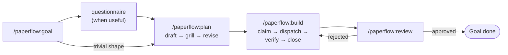

# Paperflow

<!-- Tagline rationale: A — mirrors the oh-my-claudecode "Don't learn X" pattern; punchy, action-oriented, leads with the verb the user actually does (open a Goal). B describes the medium; C only positions. A makes the user immediately understand what changes. -->
***Don't write specs. Open a Goal — paperflow plans, grills, builds, reviews.***


[Install](#install) · [What it looks like](#what-it-looks-like) · [The loop](#the-loop) · [The eight skills](#the-eight-skills) · [Authoring docs](#authoring-docs) · [Troubleshoot](#troubleshoot) · [Architecture](ARCHITECTURE.md)

---

## Install

### Install via Claude Code plugin (recommended)

```
/plugin marketplace add https://github.com/FRIKKern/paperflow
/plugin install paperflow
/paperflow:setup
```

The first two are stock Claude Code commands. The third runs the bundled `install.sh` after explaining what it touches and asking for consent — LaunchAgents on ports 8765 + 8766, the cmux dock daemon, statusline, `~/.claude/CLAUDE.md`, `~/.local/bin/` shims, optional brew installs.

### Or install via terminal

```bash
curl -fsSL https://raw.githubusercontent.com/FRIKKern/paperflow/main/scripts/quickstart.sh | bash
```

About a minute. Idempotent — re-run any time to upgrade. Hard-fails the install if any service is unhealthy (no silent broken state).

*Prefer to read first?* `git clone https://github.com/FRIKKern/paperflow.git ~/Documents/GitHub/paperflow && bash ~/Documents/GitHub/paperflow/install.sh`

**Prerequisites:**

- macOS only. Linux is an explicit non-goal — `paperflow-target` and the cmux integration are mac-specific.
- [Homebrew](https://brew.sh) — used to auto-install `jq` and `beads` if missing.
- Node 22+ (`brew install node` or `brew install nvm && nvm install 22`).
- Any modern terminal — cmux is best (paperflow's Dock and tab-reuse contracts target it).

Full install detail, optional `--with-*` flags, manual install, and uninstall in [INSTALL.md](INSTALL.md).

**After install:**

1. **Restart Claude Code** (or run `/hooks` in any already-running session) so hooks, skills, and `CLAUDE.md` get picked up.
2. Run `/paperflow:goal "your first goal vision"` — or `/paperflow:autopilot "your vision"` if you want paperflow to chain plan → grill → build → review for you (pauses at the grill so you stay in the loop).

---

## What it looks like

<!-- TODO: insert ~10s loop GIF + 2 screenshots (rail, dock) -->

You write specs, plans, and grills as standalone HTML articles in `~/docs/paperflow/` — typography, captioned figures, Mermaid diagrams. Every doc carries a sticky right rail showing the active Goal's lifecycle as a clickable git-graph. Under cmux, four live feeds stream into the right-side Dock: active Goal/Phase/Task, ready tasks, recent events, auto-open log. Action buttons inside each doc — Build this plan, Grill the spec, Submit, Simplify — POST back to the bridge, which routes the message into the originating terminal where Claude is running.

The statusline shows the active Goal and Phase at a glance:

```
137,420 / 1M · 1209d022 · onboarding-revamp · ▸ phase 2/3: build · ▸ paperflow-a1b2.2.3 wire-bridge · 4/9 · main
```

Files you'll touch:

```
~/docs/paperflow/specs/<date>-<slug>.html        # specs
~/docs/paperflow/plans/<date>-<slug>.html        # plans
~/docs/paperflow/grills/<date>-<slug>.html       # grill stress-tests
~/docs/paperflow/goals/<slug>/index.html         # the Goal's HTML home
~/docs/paperflow/changelog/<date>-<topic>.html   # before/after proof pages
<repo>/.paperflow/{active-goal,active-phase}     # the entire mutable state
```

---

## Why paperflow?

- **No more half-finished plans.** The loop forces grill → revise before build, and the build step verifies before closing tasks. Reviews can re-open a build-task on rejection — the same Beads ID, same `branch:main`, no orphan work.
- **Click, don't type.** Specs, plans, and grills are HTML — you click "Build this plan" or fill out a grill form, the answer routes back into the terminal Claude is running in. The bridge handles tmux, iTerm2, Apple Terminal, and cmux.
- **One orchestrator instance.** Subagent thresholds (>30 LOC, >50 lines prose, >500 tokens) are enforced — orchestrator stays clean, work happens in subagents. Every commit over the LOC gate carries a `Subagent-Run: <task-id>` trailer; `/paperflow:review` audits every commit and re-opens on missing trailers.
- **One source of truth.** Beads (`bd`) holds goals, phases, tasks, and events. No JSON sidecars, no parallel state. The active Goal and Phase live in two pointer files (`<repo>/.paperflow/active-{goal,phase}`) — that's the entire mutable state on disk.

---

## What you get

| Component | What it does |
|---|---|
| Eight skills `/paperflow:{goal,plan,build,review,install,resume,setup,autopilot}` | Open a Goal, plan it, build it, review it, install/upgrade, resume later, first-time host install — and `autopilot` chains the whole lifecycle in one push (pauses at grill) |
| Article-style HTML docs | Specs, plans, grills, questionnaires, changelogs — typography, captioned figures, Mermaid throughout |
| Goal-path right rail | Sticky 240 px panel showing the Goal's lifecycle as a Mermaid `gitGraph`; click to jump, shift-click to diff |
| paperflow Dock (cmux) | Four live feeds in cmux's sidebar: active context, ready tasks, recent events, auto-open log |
| Subagent enforcement | Hard 30 LOC / 50 line / 500 token thresholds, structured `Subagent-Run:` commit trailers, audited in review |
| Live-render server | `~/docs/` served on port 8765 with WebSocket hot reload (~200 ms refresh, scroll-preserving) |
| Beads as state | Goals, phases, tasks, events all live in `bd` — no JSON sidecars, no parallel state |
| The bridge | Local Node HTTP server on `:8766` routing browser button clicks back into your terminal |

---

## The loop



paperflow's lifecycle. The orchestrator opens a Goal, optionally runs a questionnaire when shape is unclear, drafts a plan, grills it with 8–15 pointed questions, revises, then loops `build → review` until the active phase empties. Rejection re-opens the build-task on the same `branch:main`. The orchestrator is one Claude Code instance; every non-trivial step is delegated to a subagent.

A typical session in your terminal:

```
> /paperflow:goal "rewrite onboarding"
✓ Goal opened: paperflow-a1b2 (onboarding-revamp)
  → ~/docs/paperflow/goals/onboarding-revamp/index.html

> /paperflow:plan
  draft → grill (12 questions) → revise
  ✓ 9 work-tasks materialised under phase-build

> /paperflow:build
  ✓ paperflow-a1b2.2.1 closed (subagent: 47 LOC, verified)
  ✓ paperflow-a1b2.2.2 closed (subagent: 22 LOC, verified)
  …
```

---

## The eight skills

Six lifecycle skills, plus the plugin `setup` skill that runs `install.sh` after `/plugin install paperflow`, plus `autopilot` — the momentum-mode wrapper that chains the lifecycle in one push (with a mandatory pause at the grill). `scripts/check-skill-count.sh` fails CI if a 9th lands without a displacement.

| Skill | What it does | Trigger phrases |
|---|---|---|
| `/paperflow:goal` | Opens, snapshots, or archives a Goal — creates the goal-task, three default phases, both pointer files, renders the Goal HTML. | "start a goal", "snapshot the goal", "archive the goal" |
| `/paperflow:plan` | Drafts a plan, grills it with 8–15 pointed questions, revises; materialises plan steps as Beads work-tasks. Simplify is a sub-action here. | "plan X", "grill this plan", "simplify this doc" |
| `/paperflow:build` | Claims the next ready task, dispatches a subagent, verifies on return, closes; loops the phase, advances when empty. | "build", "next step", "ship it", "next phase" |
| `/paperflow:review` | Opens a review-task linked to a build-task; delegates the review (or site audit) to a subagent. Includes a Subagent-Run audit. | "request review", "review this PR", "audit my site" |
| `/paperflow:install` | The meta-skill — install, upgrade, reset, integration opt-in, author a new SKILL.md, write release changelogs. | "install paperflow", "upgrade paperflow", "what is paperflow?" |
| `/paperflow:resume` | Mirrors Claude Code's `/resume` for Goals. Lists Goals via Beads, presents a numbered menu, flips the two pointers on pick. | "/resume", "list goals", "switch to goal X" |
| `/paperflow:setup` | First-run host install — runs `install.sh` after `/plugin install paperflow`. Re-run with `--upgrade` or `--reset`. | "/paperflow:setup" after a fresh plugin install |
| `/paperflow:autopilot` | Chains `goal → plan → grill → build → review` in one push. Pauses MANDATORY at the grill (unless `--skip-grill`). Stops one click short of archive. | "autopilot", "run on autopilot", "do the whole flow" |

Each non-exempt skill carries an inlined copy of `lib/shared-thresholds.md` between `<!-- BEGIN paperflow-thresholds -->` / `<!-- END paperflow-thresholds -->` sentinels. `install.sh` re-splices on every run. `/paperflow:resume` is exempt (read-only).

---

## Goal-path rail

Every paperflow doc loaded with an active Goal renders a 240 px sticky right rail showing the Goal's lifecycle as a Mermaid `gitGraph`. The rail tracks **events** (`goal-opened`, `plan-written`, `plan-grilled`, `phase-advanced`, `simplified-*`, `goal-closed`, …), not doc revisions. Click an older event to walk back — the next save lands on a fresh `branch:alt-<n>`. Shift-click two nodes for a line-level diff. Every plan, spec, and grill also carries a Simplify button: one click runs a leaning-pass subagent through a two-tier verification gate; the result lands as a `branch:simplified-<n>` event you can Accept or Reject from the rail. The original is always one click-jump away.

Architecture details: see [ARCHITECTURE.md#goal-path-rail](ARCHITECTURE.md#goal-path-rail) and [ARCHITECTURE.md#simplify-pipeline](ARCHITECTURE.md#simplify-pipeline).

---

## Authoring docs

Specs, plans, grills, questionnaires, Goal HTML, and changelogs are standalone HTML articles, not Markdown. The shared stylesheet at `/paperflow/_lib/doc.css` carries all the typography (eyebrow, ingress, byline, captioned figures, serif body, sans headings) — never ship inline `<style>` blocks. Distribute Mermaid diagrams throughout: every section explaining a flow, comparison, or decision gets one. Aim for at least one figure per ~300 words. Always open via the live-reload URL (`http://localhost:8765/paperflow/...`), never `file://`.

End every doc with:

```html
<script>
  window.CLAUDE_TARGET     = /* paperflow-target output */;
  window.DOC_PATH          = "<this-filename>.html";
  window.PAPERFLOW_GOAL_ID = "<goal-id>";
</script>
<script src="/paperflow/_lib/doc.js"></script>
```

`doc.js` reads the URL and injects the right action buttons per doc type (`/specs/`, `/plans/`, `/grills/`, `/goals/`, `/changelog/`). Canonical references in the repo: [`examples/openclaw-spec.html`](./examples/openclaw-spec.html), [`examples/openclaw-grill.html`](./examples/openclaw-grill.html), [`examples/example-questionnaire.html`](./examples/example-questionnaire.html). The PostToolUse hook runs `paperflow-validate` on every save and surfaces Mermaid syntax errors as a `<system-reminder>` so Claude fixes them before reporting the URL — up to 3 iterations.

---

## Troubleshoot

**`brew not found`** — paperflow's auto-install relies on Homebrew. Install brew first at https://brew.sh, then re-run the quickstart. macOS-only — Linux is not supported.

**Bridge port 8766 unreachable** — self-test failed at the bridge ping. Check `lsof -i :8766` for a stale process; kill it and re-run install. Only one paperflow bridge can listen on 8766 at a time.

**Live-server port 8765 unreachable** — same idea: `lsof -i :8765`. Most often something else (a dev server) is squatting on the port. Either kill it or override the live-server port in the LaunchAgent plist.

**npm EACCES on global install** — paperflow's installer is nvm-aware: if your `node` is from nvm, you'll be skipped past the EACCES branch. If it's a system install (`/usr/local`), the chown remediation still applies: `sudo chown -R $(whoami) /usr/local/{lib/node_modules,bin,share}`.

**CLAUDE.md exists, but I want the new `--with-X` fragments** — re-run the installer with `--merge --with-openclaw` (or whichever flag). Each fragment has a sentinel comment, so re-merging is safe.

**Hooks duplicated in `settings.json`** — fixed in 2026-05-07: hook dedup uses exact-path match. Older duplicates: edit `~/.claude/settings.json` and remove the duplicate `command` entries under `hooks.PostToolUse[].hooks[]`.

**cmux trust broken-pipe on browser button clicks** — the bridge needs to inherit cmux's socket auth. Respawn it from inside a cmux pane: `cmux new-workspace --command "node ~/.local/lib/paperflow/claude-bridge.js"`.

**Statusline empty in a Goal-active repo** — cache stale and live composition failed. Run any Beads-mutating action (claim/close); cache rewrites.

**Goal-path rail empty on a fresh doc** — doc didn't set `window.PAPERFLOW_GOAL_ID`. Add the inline script before the `doc.js` include; rail falls back to `?source=` resolution but is silent on docs that haven't generated events yet.

**Beads not found (`bd: command not found`)** — the quickstart auto-installs Beads via Homebrew; if that failed silently, install manually: `brew install beads` or `npm i -g beads`. Re-run `bash install.sh` afterwards.

**Dock daemon dead** — `cat ~/.paperflow/dock-daemon.pid` (0 bytes if down). Restart with `bash install.sh` (respawns); inspect `tail /tmp/paperflow-dock-daemon.log` for the cause.

**Doc auto-open opens the wrong tab in cmux** — the bridge's tab-reuse contract de-dupes by URL. Same URL refocuses; different URL opens a new tab. If a stale tab is sticky, close it and re-trigger the save.

### Logs

```
~/.local/log/docs-livereload.{out,err}.log
~/.local/log/claude-bridge.{out,err}.log
/tmp/paperflow-dock-daemon.log               # non-cmux stderr
~/.paperflow/auto-open.log                   # auto-open events (rotates at 1 MB)
~/.paperflow/simplify-failures.log           # rejected Simplify candidates
~/.paperflow/questionnaire-skips.log         # skipped questionnaires
```

---

## Architecture & internals

paperflow's bridge HTTP endpoints, hook composition, statusline internals, dock daemon, simplify pipeline, subagent thresholds, and repo layout are documented in [ARCHITECTURE.md](ARCHITECTURE.md). Read that if you're hacking on paperflow itself.

---

## License

MIT — see [LICENSE](./LICENSE).

paperflow draws on patterns from [`obra/superpowers`](https://github.com/obra/superpowers) (MIT) — `/paperflow:plan` adapts `writing-plans` and `brainstorming`; `/paperflow:build` adapts `executing-plans`, `verification-before-completion`, `subagent-driven-development`, `dispatching-parallel-agents`, `using-git-worktrees`, `systematic-debugging`; `/paperflow:review` adapts `requesting-code-review`, `receiving-code-review`, `finishing-a-development-branch`. Where a section is structurally identical to an upstream skill, an inline note in the SKILL.md points back to [THIRD-PARTY-CREDITS.md](./THIRD-PARTY-CREDITS.md).

paperflow uses [Beads](https://github.com/gastownhall/beads) (MIT) as the system of record. Beads is invoked as a runtime dependency — paperflow does not bundle, redistribute, or modify it.
