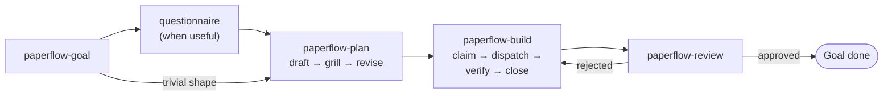
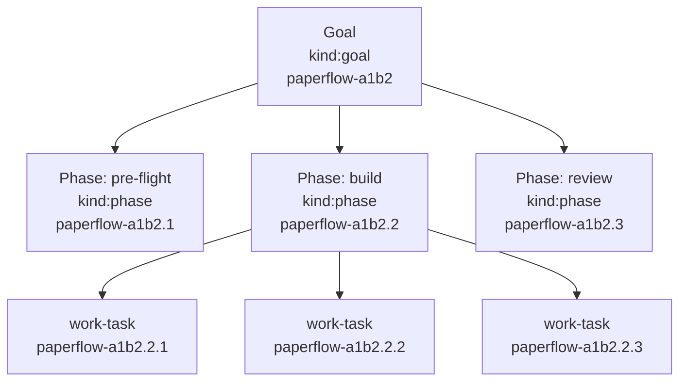
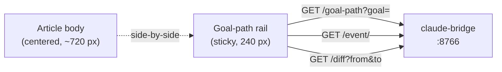
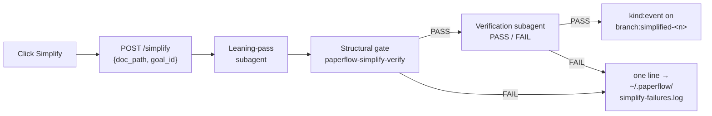

# paperflow

*structured Claude Code workflow — Goals · Phases · Tasks*

```bash
curl -fsSL https://raw.githubusercontent.com/FRIKKern/paperflow/main/scripts/quickstart.sh | bash
```

Auto-installs missing prereqs (jq, Beads) on macOS via Homebrew. Idempotent — re-run any time to upgrade.

`macOS only · ~60 seconds · idempotent`

---

## What you get

| Component | What it does |
|---|---|
| Six skills `/paperflow-{goal,plan,build,review,install,resume}` | Open a Goal, plan it, build it, review it, install/upgrade, resume later |
| Article-style HTML docs | Specs, plans, grills, questionnaires, changelogs — typography, captioned figures, Mermaid throughout |
| Goal-path right rail | Sticky 240 px panel showing the Goal's lifecycle as a Mermaid `gitGraph`; click to jump, shift-click to diff |
| paperflow Dock (cmux) | Four live feeds in cmux's sidebar: active context, ready tasks, recent events, auto-open log |
| Subagent enforcement | Hard 30 LOC / 50 line / 500 token thresholds, structured `Subagent-Run:` commit trailers, audited in review |
| Live-render server | `~/docs/` served on port 8765 with WebSocket hot reload (~200 ms refresh, scroll-preserving) |

---

## The loop



paperflow's lifecycle. The orchestrator opens a Goal, optionally runs a questionnaire when shape is unclear, drafts a plan, grills it with 8–15 pointed questions, revises, then loops `build → review` until the active phase empties. Rejection re-opens the build-task on the same `branch:main`. The orchestrator is one Claude Code instance; every non-trivial step is delegated to a subagent.

---

## Install

```bash
curl -fsSL https://raw.githubusercontent.com/FRIKKern/paperflow/main/scripts/quickstart.sh | bash
```

### What the installer does

- Clones (or pulls) the repo to `~/Documents/GitHub/paperflow`
- Auto-installs `jq` and `beads` via Homebrew when missing; falls back to `npm i -g beads` if brew install fails
- Writes two LaunchAgents (or, under cmux, two cmux workspaces): `docs-livereload` on port 8765, `claude-bridge` on port 8766
- Drops the six skills under `~/.claude/skills/paperflow-*/`, the four hooks under `~/.claude/hooks/`, the renderers under `~/docs/paperflow/_lib/`
- Creates `~/.claude/CLAUDE.md` from the template if missing (lean by default — integration prose is opt-in)
- Wires `~/.claude/settings.json` for hooks + statusline; dedups by exact command path
- Runs a self-test on the active-scope resolver, the bridge port, and the live-server port — hard-fails the install if any service is unhealthy

### Prereqs

- **macOS only.** Linux is an explicit non-goal — `paperflow-target` and the cmux integration are mac-specific.
- **Node 22+.** Install with `brew install node` or `brew install nvm && nvm install 22`. The installer pre-flights this and bails with a hint if missing.
- **Homebrew.** Auto-install of `jq` + `beads` requires brew. No brew? Install it first at https://brew.sh, then re-run.
- **git** + **xcode-select tools** (`xcode-select --install` if missing).

### Optional flags

| Flag | Effect |
|---|---|
| `--yes` | Skip all confirmations. Auto-set when stdin is not a TTY (CI, unattended runs). |
| `--merge` | Append new `--with-*` fragments to an existing `~/.claude/CLAUDE.md` without rebuilding it. Each fragment carries a sentinel comment, so re-merging is safe. |
| `--reset` | Tarball `~/.claude/{CLAUDE.md,hooks,skills}` and `~/.paperflow/` to `~/.paperflow/backups/<ts>.tar.gz`, then rebuild from scratch. Existing customizations lost. |
| `--with-openclaw` | Append the OpenClaw delegation fragment (local LLM agent). Verifies `/opt/homebrew/bin/openclaw`; warns non-fatally if missing. Does not install OpenClaw. |
| `--with-unlighthouse` | Append the Unlighthouse fragment. Offers to `npm i -g @unlighthouse/cli puppeteer`. |
| `--with-browserbase` | Append the BrowserBase fragment (cloud parallel browsing — future). No binary check. |
| `--reset-dock` | Rebuild `${XDG_CONFIG_HOME:-$HOME/.config}/cmux/dock.json` from the template (after backing up to `dock.json.bak.<ts>`). Without this, the install skips a pre-existing dock config. |

### After install

1. **Restart Claude Code** (or run `/hooks` in any already-running session) so hooks, skills, and `CLAUDE.md` get picked up.
2. Open Claude Code in any terminal — a cmux pane is best, since the bridge inherits cmux's socket trust there.
3. Run `/paperflow-goal "your first goal vision"`. Click through the Goal HTML, plan, grill — paperflow handles the rest.

---

## Goals · Phases · Tasks

The hierarchy maps 1:1 to Beads' native hierarchical IDs.



| Layer | Beads kind | Example ID | Lives at |
|---|---|---|---|
| Goal | `kind:goal` | `paperflow-a1b2` | top-level Beads task |
| Phase | `kind:phase` | `paperflow-a1b2.2` | child of the goal-task |
| Task | (work-task) | `paperflow-a1b2.2.3` | child of the phase-task |
| Event | `kind:event` | `paperflow-a1b2.evt` | sidecar history; hidden from default `bd list`/`bd ready` |

Two pointer files in `<repo>/.paperflow/` say what's active in this checkout:

```
<repo>/.paperflow/active-goal     # one line: paperflow-a1b2
<repo>/.paperflow/active-phase    # one line: paperflow-a1b2.2
```

Lookup walks up from cwd to the nearest `.paperflow/`. With neither file present anywhere up to `/`, paperflow has no active goal/phase. Both pointers are written by `paperflow-goal` (on open) and `paperflow-resume` (on switch). `paperflow-build` advances `active-phase` when the current phase empties.

Under the hood, Goal-tasks use Beads' native `--type epic`; `paperflow-build` calls `bd epic close-eligible` at phase-empty to auto-close completed Goals. The user-facing word stays "Goal." For multi-axis outcomes spanning more than one Goal, apply an optional `umbrella-<slug>` label — `paperflow-resume` groups Goals by umbrella when one is present.

A second mirror at `~/.paperflow/active-goal` exists for hooks that fire from `~/docs/paperflow/...` (where the dev repo isn't reachable up the directory tree).

---

## The six skills

Six, exact. `scripts/check-skill-count.sh` fails CI if a 7th lands without a displacement.

| Skill | One-line purpose |
|---|---|
| `/paperflow-goal` | Open / refresh / archive a Goal — creates the goal-task, three default phases, both pointer files, renders the Goal HTML. Snapshot and archive are sub-actions of the same skill. |
| `/paperflow-plan` | Draft a plan, grill it with 8–15 pointed questions, revise. Materialises plan steps as Beads work-tasks under the active phase. Simplify is a sub-action here. |
| `/paperflow-build` | Claim the next ready task, dispatch a subagent, verify on return, close. Loop the phase, advance when empty. TDD / parallel agents / worktrees are opt-in; verification-before-completion is always on. |
| `/paperflow-review` | Open a review-task linked to a build-task; delegate the review (or site audit) to a subagent. Approval closes; rejection re-opens the build-task. Includes a Subagent-Run audit on the build-phase commits. |
| `/paperflow-install` | The meta-skill. Install / upgrade / reset, integration opt-in (`--with-openclaw/--with-browserbase/--with-unlighthouse`), authoring a new SKILL.md (subject to the 6-skill cap), writing release changelogs. The "what is paperflow?" entry point. |
| `/paperflow-resume` | Mirrors Claude Code's `/resume` for Goals. Lists Goals via Beads, presents a numbered menu, flips the two pointers on pick, surfaces unfinished questionnaires. Read-only on Beads. |

Each non-exempt skill carries an inlined copy of `lib/shared-thresholds.md` between `<!-- BEGIN paperflow-thresholds -->` / `<!-- END paperflow-thresholds -->` sentinels. `install.sh` re-splices on every run. `paperflow-resume` is exempt (read-only).

---

## Beads — the system of record

paperflow uses Beads (`bd`) as the single source of truth for goals, phases, tasks, and events. No JSON sidecars, no parallel state. The quickstart auto-installs Beads via Homebrew on macOS — you don't need to install it manually.

Per-repo init: `paperflow-bd-init` runs `bd init` once on the first Goal in a repo. `paperflow-build` claims with `bd update <id> --claim` and closes with `bd update <id> --close`. `bd ready --label goal-<slug> --label phase-<active>` returns the next ready work-task within the active phase.

### Label conventions

| Label | Meaning |
|---|---|
| `kind:goal` | Goal-task. One per Goal. |
| `kind:phase` | Phase-task. Three per default Goal (pre-flight, build, review). |
| `kind:event` | Sidecar event in the goal-path rail. Hidden from default `bd list`/`bd ready` via `~/.beads/aliases.toml` blocks the installer appends. |
| `goal-<slug>` | Every task descends a Goal — work-tasks, phase-tasks, events all carry this. |
| `phase-<name>` | Phase scoping — e.g. `phase-build`. Used by `bd ready --label`. |
| `branch:main` / `branch:alt-<n>` / `branch:simplified-<n>` | Branch markers on rail events. |
| `event:<name>` | The lifecycle event type (`event:goal-opened`, `event:plan-written`, etc.). |
| `source:<rel-path>` | Doc the event was emitted from; powers `?source=` lookup. |

To peek at events anyway: `bd list --label kind:event`. On Beads versions that don't honour the alias file, that flag is the documented fallback.

---

## Goal-path right rail

Every paperflow doc loaded with an active Goal in scope renders a 240 px sticky right rail showing the Goal's lifecycle as a Mermaid `gitGraph`. The rail tracks **events**, not doc revisions: `goal-opened`, `questionnaire-written`, `questionnaire-answered`, `plan-written`, `plan-grilled`, `phase-advanced`, `goal-snapshot`, `goal-closed`, `simplified-*`. Events live as `kind:event` Beads tasks parented to the goal-task, with HTML payloads at `~/.paperflow/events/<event-task-id>.html`.



Two ways to find the Goal for a given doc:

- `GET /goal-path?goal=<id>` — explicit, when the page sets `window.PAPERFLOW_GOAL_ID`.
- `GET /goal-path?source=<rel-path>` — fallback, walks events with `source:<rel-path>` and returns the latest one's goal id.

`GET /event/<id>` serves the sidecar payload. `GET /diff?from=<id>&to=<id>` returns a line-level diff via `lib/text-diff.js` (vendored — no CDN, no jsdiff).

**Walk-back.** Click an older event in the rail; `lib/goal-path-rail.js` writes its id to `<repo>/.paperflow/active-event-base`. The next save reads the pointer, parents the new event there, and lands it on a fresh `branch:alt-<n>`. The hook clears the pointer afterwards. Shift-click two distinct nodes to open the diff modal.

**Cross-doc lineage.** When a doc carries `<meta name="paperflow-spawned-from" content="<rel-path>">`, the rail shows `↳ from <basename>` at the top. One level only — no transitive chain.

Per-page opt-out: `<script>window.PAPERFLOW_NO_RAIL = true;</script>` before the `doc.js` include.

---

## paperflow Dock (cmux)

cmux exposes a right-side Dock; paperflow puts four live feeds in it, surfacing the orchestrator's working memory.

| Feed | What it shows |
|---|---|
| `active-context` | Active Goal, active Phase, currently claimed Task |
| `bd-ready` | Top of `bd ready --label phase-<active>` (priority + title) |
| `goal-path` | Recent `kind:event` rows for goal+phase, sorted desc |
| `auto-open-log` | Tail of `~/.paperflow/auto-open.log` |

A single Node daemon (`~/.local/bin/paperflow-dock-daemon`, no deps) polls Beads on a 2 s internal cadence, caches the four feeds, and serves them on a UNIX socket at `~/.paperflow/dock.sock`. Each Dock pane runs `watch -n 5 paperflow-dock-feed <name>`; the client is ~15 LOC of bash that `nc -U`s the socket and prints. PID file at `~/.paperflow/dock-daemon.pid`.

Config lives at `${XDG_CONFIG_HOME:-$HOME/.config}/cmux/dock.json`. Skip-on-existing default; `bash install.sh --reset-dock` overwrites (after backing up).

```bash
paperflow-dock-feed active-context        # query directly
cat ~/.paperflow/dock-daemon.pid          # PID file (0 bytes if down)
tail /tmp/paperflow-dock-daemon.log       # non-cmux stderr
kill $(cat ~/.paperflow/dock-daemon.pid)  # graceful shutdown
bash install.sh                           # respawns daemon
```

---

## Simplify

Every plan, spec, and grill HTML carries a **Simplify** button. One click runs a leaning-pass subagent against the doc; the candidate goes through a two-tier verification gate before it lands as a new event on `branch:simplified-<n>` in the goal-path rail. The original is always one click-jump away.



The gate is the never-worse guarantee — Mermaid figures, H2 hierarchy, bound decisions, and outbound URLs must all survive. **Trim categories** the leaning pass attempts: verbose phrasing, redundancy, example bloat, low-signal sub-bullets, hedging words. **Never cut**: Mermaid figures, H2 headings, bound decisions, outbound URLs, the ingress.

When a `branch:simplified-*` node is selected on the rail, Accept calls `POST /simplify/accept` (bridge writes the simplified payload back to the source HTML and relabels the event to `branch:main`); Reject calls `POST /simplify/reject` with an optional reason. The source HTML on disk is unchanged until the user explicitly accepts.

Implementation lives in `paperflow-plan` as a sub-action — no new skill, the 6/6 cap holds.

---

## Subagent enforcement

paperflow's orchestrator follows a hard subagent-dispatch rule with concrete numeric thresholds and a structured commit-message marker. The single source of truth lives at `lib/shared-thresholds.md`; each non-exempt skill carries an inlined copy refreshed on every `bash install.sh` run.

**Hard thresholds — above ANY of these, the orchestrator MUST dispatch a subagent:**

- **> 30 LOC** of new code (across all files in one logical unit)
- **> 50 lines** of new prose / markdown
- **> 500 tokens** of raw tool output captured / synthesised

Bash glue ≤ 25 LOC stays inline; other languages hold the 30 LOC gate. Beads bookkeeping, pointer-file writes, single-line edits, and verbatim subagent output are exempt — see the full carve-out list in `lib/shared-thresholds.md`.

**Pre-write checkpoint.** Before any inline `Write` / `Edit` over threshold, the orchestrator prints a one-line justification:

```
Doing inline because: <reason>. Above threshold would be <subagent-reason>.
```

**Verification subagent.** When a build subagent returns more than 500 tokens of evidence, `paperflow-build` dispatches a SECOND subagent — a verification-subagent — which returns `PASS:` / `FAIL:` only. The orchestrator never absorbs raw evidence.

**Commit-message marker.** Any commit touching > 30 LOC includes a structured trailer:

```
Subagent-Run: <task-id>
```

`bin/paperflow-audit-orchestrator-budget` flags over-threshold commits that lack this trailer. `paperflow-review` runs the audit on every review-task; the reviewer must justify or re-open.

---

## The bridge

`claude-bridge` is a tiny Node HTTP server on `localhost:8766`. Browser buttons POST `{target, message}` (or richer payloads) to one of the endpoints; the bridge dispatches into the originating terminal tab.

| Endpoint | Purpose |
|---|---|
| `GET /` | Liveness ping |
| `POST /build` | Dispatch a message into the originating terminal (tmux / iTerm / Apple Terminal / cmux) |
| `POST /marker` | Questionnaire-answered sidecar; also fires `event:questionnaire-answered` when an active goal is known |
| `GET /goal-path?goal=<id>` | Goal-path event subtree for the rail |
| `GET /goal-path?source=<rel>` | Resolve goal id by latest `source:<rel>` event |
| `GET /event/<task-id>` | Sidecar payload for one event-task |
| `POST /event` | Create a `kind:event` Beads task + sidecar |
| `POST /event/active` | Write `<repo>/.paperflow/active-event-base` (walk-back pointer) |
| `GET /diff?from=<id>&to=<id>` | Bridge-side line-level diff between two events |
| `POST /simplify` | Kick off a leaning-pass + verification job; returns `{ok, job_id}` |
| `GET /simplify/status?job=<id>` | Poll a Simplify job |
| `POST /simplify/accept` | Promote a `simplified-<n>` event to `branch:main`, overwrite source HTML |
| `POST /simplify/reject` | Close a `simplified-<n>` event with a reason |

The bridge supports tmux (any host), iTerm2 (`write text`), Apple Terminal (`do script in tab`), and cmux (`cmux send --workspace … --surface …`). Targeting JSON is captured at write-time by `~/.local/bin/paperflow-target` and embedded in the doc as `window.CLAUDE_TARGET`.

When the bridge is launched outside a cmux pane, it loses cmux's socket trust — re-spawn via `cmux new-workspace --command "node ~/.local/lib/paperflow/claude-bridge.js"` if button clicks return broken-pipe.

---

## Live-render server

`docs-livereload` is a `live-server@1.2.2` LaunchAgent serving `~/docs/` on port 8765 with WebSocket hot reload (~200 ms refresh). Every paperflow HTML loads `live-render.js` via `doc.js`; on file change, the client morphs the DOM in-place — scroll position is preserved, rendered Mermaid diagrams survive.

Live-render short-circuits when `location.hostname` isn't `localhost` / `127.0.0.1` / `::1`, so printed PDFs, emailed copies, and USB exports never try to open a WebSocket they can't reach. To opt out from a specific page (e.g. a fixed-snapshot demo):

```html
<script>window.PAPERFLOW_NO_LIVE_RENDER = true;</script>
```

…before the `doc.js` include.

The version is pinned because newer pre-release builds have a known WebSocket-init regression that breaks the WS-intercept the live-render client relies on.

---

## Statusline

When `<repo>/.paperflow/active-goal` exists, the bottom-bar statusline shows the goal slug, the active phase + position in the phase sequence, and the currently claimed Task with progress through the active phase:

```
137,420 / 1M · 1209d022 · onboarding-revamp · ▸ phase 2/3: build · ▸ paperflow-a1b2.2.3 wire-bridge · 4/9 · main
```

The statusline composes from a pre-rendered cache at `~/.paperflow/statusline.txt` (written by every Beads-mutating skill on claim/close); when stale, it falls through to live composition via `bd show / bd list --json`. Width-driven truncation drops phase first below 120 cols, then the task subsegments, then branch, project, session-id, in that order. Tokens always survive.

`STATUSLINE_DEBUG=1` mirrors every render to `~/.paperflow/statusline-debug.log` (rotates at 5 MB to `.log.1`).

To add a new model's context-window limit, edit `~/.paperflow/statusline-limits.json` directly. The installer never overwrites a user-edited limits file — it tracks shipped versions via `~/.paperflow/.statusline-limits-installed-sha`.

---

## Hooks

Wired into `~/.claude/settings.json` by `install.sh`:

| Hook | Event | Purpose |
|---|---|---|
| `inject-principles.sh` | `UserPromptSubmit` | Re-inject standing principles every turn — bloat-resistant against context drift. |
| `auto-open-doc.sh` | `PostToolUse(Write\|Edit)` | Open any spec/plan/grill/note/Goal HTML you write. cmux de-dupes by URL: same URL refocuses the existing tab; different URL opens a new one. Logs to `~/.paperflow/auto-open.log`. |
| `validate-paperflow-doc.sh` | `PostToolUse(Write\|Edit)` | Run `paperflow-validate` on any paperflow doc HTML; surface Mermaid syntax errors as a `<system-reminder>` so Claude fixes them before reporting the URL. Iterates up to 3 times. |
| `event-on-save.sh` | `PostToolUse(Write\|Edit)` | Emit a `kind:event` Beads task + sidecar HTML when a paperflow doc is saved. Walks up to find the active Goal; falls back to the global `~/.paperflow/active-goal` mirror when the doc lives under `~/docs/paperflow/`. |

In any **already-running** Claude Code session, run `/hooks` once after install (or restart) so hooks are picked up.

---

## Authoring docs

Specs, plans, grills, questionnaires, Goal HTML, and changelogs are standalone HTML articles — not Markdown. Article-style typography (eyebrow, ingress, byline, captioned figures, serif body, sans headings) lives in the shared stylesheet:

```html
<link rel="stylesheet" href="/paperflow/_lib/doc.css">
```

End every doc with:

```html
<script>
  window.CLAUDE_TARGET     = /* paste output of ~/.local/bin/paperflow-target */;
  window.DOC_PATH          = "<this-filename>.html";
  window.PAPERFLOW_GOAL_ID = "<goal-id>";   /* required for the rail */
</script>
<script src="/paperflow/_lib/doc.js"></script>
```

`doc.js` reads the URL path and auto-injects the right buttons:

| URL contains | Primary button | Secondary |
|---|---|---|
| `/specs/` | Create plan from this spec | Grill the spec |
| `/plans/` | Build this plan | Grill the plan |
| `/grills/`, `/questionnaires/` | Submit (handled by `_lib/grill.js`) | — |
| `/goals/` | Snapshot, Archive | — |
| `/changelog/` | Share | — |

Distribute Mermaid diagrams throughout — every section explaining a flow, comparison, or decision gets one. Aim for at least one figure per ~300 words. Always open via the live-reload URL, never `file://`:

```bash
open http://localhost:8765/paperflow/specs/<filename>.html
```

Canonical references in the repo: [`examples/openclaw-spec.html`](./examples/openclaw-spec.html), [`examples/openclaw-grill.html`](./examples/openclaw-grill.html), [`examples/example-questionnaire.html`](./examples/example-questionnaire.html).

### Doc validation (mandatory)

Every paperflow doc write runs through `paperflow-validate` automatically — a PostToolUse hook fires on Write/Edit of any HTML under `~/docs/paperflow/{specs,plans,grills,questionnaires,notes,changelog,goals,audits}/`, parses every Mermaid block (both `<pre class="mermaid">` and grill-style JS-literal `diagram:` strings), and surfaces failures as a `<system-reminder>`. Iterates up to 3 times.

---

## Repo layout

```
paperflow/
├── README.md                       # this file
├── INSTALL.md                      # install.sh details, manual install, uninstall
├── LICENSE                         # MIT
├── THIRD-PARTY-CREDITS.md          # obra/superpowers + Beads attribution
├── install.sh                      # idempotent installer
├── uninstall.sh                    # reverse it
├── claude-md.tmpl                  # template for ~/.claude/CLAUDE.md
├── claude-md-fragments/            # opt-in fragments
│   ├── browserbase.md
│   ├── openclaw.md
│   └── unlighthouse.md
├── bin/
│   ├── claude-bridge.js            # the bridge service
│   ├── get-terminal-target.sh      # captures CLAUDE_TARGET JSON
│   ├── paperflow-active-scope      # resolves goal/phase from cwd up
│   ├── paperflow-bd-init           # per-repo Beads bootstrap
│   ├── paperflow-validate          # static Mermaid check (~80 LOC Node)
│   ├── paperflow-audit-site        # Unlighthouse wrapper
│   ├── paperflow-audit-orchestrator-budget   # Subagent-Run trailer audit
│   ├── paperflow-continue          # mission-launcher (carry-over)
│   ├── paperflow-migrate-legacy-goals
│   ├── paperflow-simplify-verify   # Simplify structural gate
│   ├── paperflow-dock-daemon       # the 2 s poller
│   └── paperflow-dock-feed         # ~15 LOC bash client
├── lib/
│   ├── doc.{css,js}                # per-doc-type buttons
│   ├── grill.{css,js}              # form rendering + submit-back (also questionnaires)
│   ├── goal-path-rail.{css,js}     # right-rail renderer
│   ├── live-render.{css,js}        # DOM-morph hot-reload
│   ├── mermaid-zoom.{css,js}       # click-to-zoom modal
│   ├── simplify-button.js          # Simplify trigger
│   ├── diff-modal.js               # shift-click diff overlay
│   ├── text-diff.js                # vendored line-level diff (no jsdiff, no CDN)
│   ├── shared-thresholds.md        # source of truth for subagent thresholds
│   ├── simplify-{leaning-pass,verification}-brief.md
│   ├── statusline.sh               # one-line bottom bar
│   ├── statusline-limits.json      # editable model context-window limits
│   └── dock.json.tmpl              # cmux Dock config template
├── hooks/
│   ├── inject-principles.sh        # UserPromptSubmit
│   ├── auto-open-doc.sh            # PostToolUse(Write|Edit)
│   ├── validate-paperflow-doc.sh   # PostToolUse(Write|Edit)
│   └── event-on-save.sh            # PostToolUse(Write|Edit)
├── skills/
│   └── paperflow-{goal,plan,build,review,install,resume}/SKILL.md
├── launchagents/
│   ├── claude-bridge.plist.tmpl
│   └── docs-livereload.plist.tmpl
├── scripts/
│   ├── quickstart.sh               # the curl one-liner
│   └── check-skill-count.sh        # CI gate, 6-skill cap
├── examples/
│   ├── openclaw-spec.html
│   ├── openclaw-grill.html
│   └── example-questionnaire.html
└── tests/
    ├── dock-smoke.sh               # daemon + feed smoke test
    ├── dock/fixtures/
    ├── statusline/{run.sh, fixtures, mock-bd-bin, transcripts}/
    └── text-diff/test.js
```

---

## Troubleshooting

### Common issues

**`brew not found`** — paperflow's auto-install relies on Homebrew. Install brew first at https://brew.sh, then re-run the quickstart. macOS-only — Linux is not supported.

**Bridge port 8766 unreachable** — self-test failed at the bridge ping. Check `lsof -i :8766` for a stale process; kill it and re-run install. Only one paperflow bridge can listen on 8766 at a time.

**Live-server port 8765 unreachable** — same idea: `lsof -i :8765`. Most often something else (a dev server) is squatting on the port. Either kill it or override the live-server port in the LaunchAgent plist.

**npm EACCES on global install** — paperflow's installer is now nvm-aware: if your `node` is from nvm, you'll be skipped past the EACCES branch. If it's a system install (`/usr/local`), the chown remediation still applies: `sudo chown -R $(whoami) /usr/local/{lib/node_modules,bin,share}`.

**CLAUDE.md exists, but I want the new `--with-X` fragments** — re-run the installer with `--merge --with-openclaw` (or whichever flag). Each fragment has a sentinel comment, so re-merging is safe.

**Hooks duplicated in `settings.json`** — fixed in 2026-05-07: hook dedup now uses exact-path match. If you have leftover duplicates from before, edit `~/.claude/settings.json` and remove the duplicate `command` entries under `hooks.PostToolUse[].hooks[]`.

**cmux trust broken-pipe on browser button clicks** — the bridge needs to inherit cmux's socket auth. Respawn it from inside a cmux pane: `cmux new-workspace --command "node ~/.local/lib/paperflow/claude-bridge.js"`.

**Statusline empty in a Goal-active repo** — cache stale and live composition failed. Run any Beads-mutating action (claim/close); cache rewrites.

**Goal-path rail empty on a fresh doc** — doc didn't set `window.PAPERFLOW_GOAL_ID`. Add the inline script before the `doc.js` include; rail falls back to `?source=` resolution but is silent on docs that haven't generated events yet.

### Logs

```
~/.local/log/docs-livereload.{out,err}.log
~/.local/log/claude-bridge.{out,err}.log
/tmp/paperflow-dock-daemon.log               # non-cmux stderr
~/.paperflow/auto-open.log                   # auto-open events (rotates at 1 MB)
~/.paperflow/simplify-failures.log           # rejected Simplify candidates
~/.paperflow/questionnaire-skips.log         # skipped questionnaires
```

---

## License + credits

MIT — see [LICENSE](./LICENSE).

paperflow draws on patterns from `obra/superpowers` (MIT) — `paperflow-plan` adapts `writing-plans` and `brainstorming`; `paperflow-build` adapts `executing-plans`, `verification-before-completion`, `subagent-driven-development`, `dispatching-parallel-agents`, `using-git-worktrees`, `systematic-debugging`; `paperflow-review` adapts `requesting-code-review`, `receiving-code-review`, `finishing-a-development-branch`; `paperflow-install` adapts `writing-skills` and the entry-point `using-superpowers` shape. Where a section is structurally identical to an upstream skill, an inline note in the SKILL.md points back to [THIRD-PARTY-CREDITS.md](./THIRD-PARTY-CREDITS.md).

paperflow uses [Beads](https://github.com/gastownhall/beads) (MIT) as the system of record. Beads is invoked as a runtime dependency — paperflow does not bundle, redistribute, or modify it.
