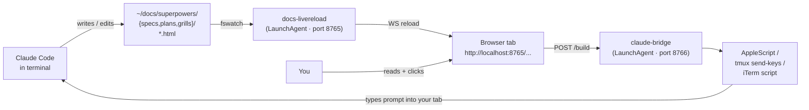

# paperflow

> Beautiful HTML specs, plans, and grills for Claude Code — with a live-reload browser, action buttons that route back to your terminal, and a complete editorial workflow.

When Claude writes a spec or plan, you usually want to see it, react to it, and bounce next steps back into Claude. **paperflow turns that loop into a single click.**

- Specs and plans are **standalone HTML articles** (not Markdown), with article-style typography (ingress, brødtekst, captioned figures), and Mermaid diagrams throughout.
- A **live-reload server** auto-refreshes the browser when Claude edits the file (~200 ms).
- Each doc has **action buttons** — *Build this plan*, *Grill the plan* — that POST to a tiny local bridge.
- The **bridge** routes the click back into your originating terminal tab via AppleScript / iTerm / tmux, so you see the prompt land where you're already working.
- A **grill workflow**: critique any plan, get a structured form of pointed questions with rationale + recommendation + per-question diagrams, and submit answers as a single message back to Claude.
- A **UserPromptSubmit hook** re-injects your standing principles every turn — so Claude doesn't drift even at 60% context.

---

## Architecture



The whole loop runs locally on your Mac. No cloud, no telemetry. Two LaunchAgents, two background ports, four shell scripts.

---

## What you get

| Component | Path on your Mac | Purpose |
|---|---|---|
| `docs-livereload` LaunchAgent | `~/Library/LaunchAgents/dev.<user>.docs-livereload.plist` | Hot reload for `~/docs/` on port 8765 |
| `claude-bridge` LaunchAgent | `~/Library/LaunchAgents/dev.<user>.claude-bridge.plist` | Routes browser button clicks back to your terminal |
| Standing principles | `~/.claude/CLAUDE.md` | Loaded into every Claude Code session |
| UserPromptSubmit hook | `~/.claude/hooks/inject-principles.sh` | Re-injects principles every turn (bloat-resistant) |
| Auto-open hook | `~/.claude/hooks/auto-open-doc.sh` | Opens any spec/plan/grill HTML you write |
| Doc renderer | `~/docs/superpowers/_lib/doc.{css,js}` | Auto-injects per-doc-type action buttons |
| Grill renderer | `~/docs/superpowers/_lib/grill.{css,js}` | Form rendering + submit-back for grills |
| Skills | `~/.claude/skills/{grill-plan,paperflow-install,discuss}/SKILL.md` | Claude invokes these on demand |
| Target helper | `~/.local/bin/paperflow-target` | Emits JSON describing your terminal so doc generators can embed it |

---

## Install

```bash
git clone git@github.com:FRIKKern/paperflow.git ~/Documents/GitHub/paperflow
bash ~/Documents/GitHub/paperflow/install.sh
```

Verify:

```bash
curl -s http://127.0.0.1:8765/    # docs-livereload (returns directory listing)
curl -s http://127.0.0.1:8766/    # claude-bridge (returns "claude-bridge ok")
```

In any **already-running** Claude Code session, run `/hooks` once (or restart) so the hooks are picked up. New sessions get them on startup automatically.

### Pre-requisites

| Need | Install |
|---|---|
| macOS 12+ | (you're on a Mac) |
| Node 22+ | `brew install nvm && nvm install 22` (or `brew install node`) |
| `jq` | `brew install jq` |
| Xcode CLI tools | `xcode-select --install` |
| Claude Code | <https://claude.com/code> |

`install.sh` checks Node and bails clearly if it's missing. Everything else is built into macOS.

### Customize the LaunchAgent label

By default, plists are labeled `dev.<your-username>.docs-livereload` and `dev.<your-username>.claude-bridge`. To change the namespace:

```bash
LABEL_PREFIX=dev.youralias bash install.sh
```

---

## Daily flow

```mermaid
flowchart LR
    Ask["You ask Claude<br/>'design a feature for X'"]
    Spec["Claude writes<br/>spec.html"]
    Open1["Auto-opens<br/>in browser"]
    Read["You read it"]
    Grill["Click <strong>Grill the spec</strong>"]
    GrillHTML["Claude writes<br/>grill.html<br/>(question form)"]
    Open2["Auto-opens"]
    Answer["You answer<br/>(or accept Claude's picks)"]
    Submit["Click <strong>Send answers</strong>"]
    Revise["Claude revises<br/>spec.html"]
    Plan["Click <strong>Create plan</strong><br/>from the spec"]
    PlanHTML["Claude writes<br/>plan.html"]
    Build["Click <strong>Build this plan</strong>"]
    Done(["Implementation in<br/>your terminal"])

    Ask --> Spec --> Open1 --> Read --> Grill --> GrillHTML --> Open2 --> Answer --> Submit --> Revise
    Revise --> Plan --> PlanHTML --> Build --> Done
```



1. **Write a spec.** Ask Claude. The HTML lands in `~/docs/superpowers/specs/<date>-<topic>-design.html` and auto-opens in your browser.
2. **Optionally grill it.** Hit *Grill the spec* — Claude generates a structured question form with pre-selected recommendations, per-question diagrams, and a "write your own" override on every question. Auto-opens.
3. **Submit answers.** Hit *Send answers to Claude* — the structured answers land as a prompt in *your* terminal. Claude integrates them.
4. **Create a plan.** Hit *Create plan from this spec* — Claude writes the plan.
5. **Build.** Hit *Build this plan* — Claude implements.

Each artifact gets a different button set automatically based on its URL path:

| URL contains | Primary button | Secondary |
|---|---|---|
| `/specs/` | Create plan from this spec | Grill the spec |
| `/plans/` | Build this plan | Grill the plan |
| `/grills/` | Send answers (rendered by `grill.js`) | — |
| `/notes/` | Reply (textarea → terminal) | Make this a spec |

---

## How docs hook into the bridge

Every spec/plan HTML ends with two short script tags:

```html
<script>
  window.CLAUDE_TARGET = /* JSON from `paperflow-target` */;
  window.DOC_PATH = "<this-filename>.html";
</script>
<script src="/superpowers/_lib/doc.js"></script>
```

`doc.js` reads the URL, decides the doc type, injects the correct buttons, and POSTs `{target, message}` to `http://localhost:8766/build` when clicked. The bridge dispatches the message into the terminal tab identified by `CLAUDE_TARGET`.

**Capture target at write-time:**

```bash
~/.local/bin/paperflow-target
# {
#   "term_program": "Apple_Terminal",
#   "tty": "/dev/ttys007",
#   "term_session_id": "...",
#   "tmux_pane": "",
#   "pid": 44635
# }
```

Paste the JSON into `window.CLAUDE_TARGET` in the generated HTML. The bridge supports tmux (any host), iTerm2 (`write text`), Apple Terminal (`do script in tab`), and a generic activate-and-keystroke fallback.

---

## Grill format

Grills are HTML forms that Claude generates via the `grill-plan` skill. Each question is an object with this shape:

```js
{
  id: "q3",
  category: "Failure modes",
  type: "single",   // "open" | "single" | "multi" | "yesno" | "scale"
  text: "OpenClaw says it succeeded but the result is wrong — how does Claude detect?",
  rationale: "The spec defines failure as non-zero exit, but a wrong-but-confident return is the more dangerous failure mode...",
  diagram: `flowchart LR
    OC["OpenClaw 'success'"] --> A["Trust"]
    OC --> B["Screenshot + vision"]
    OC --> C["Re-query state"]`,
  options: ["Trust", "Screenshot + vision", "Re-query state", "Ask user"],
  recommendation: "Re-query state",
  recommendationReason: "Targeted re-query is fast, deterministic, and only needs to run for state-changing tasks."
}
```

The renderer pre-selects Claude's recommendation, shows a "★ Claude's pick: ..." callout, and gives every non-open question an *Or write your own answer* override. See `examples/openclaw-grill.html`.

---

## Subagent-driven by default

Paperflow follows a **subagent-first** workflow: the main Claude session does decisions, synthesis, and conversation; subagents do the research, execution, and artifact-writing. Each subagent burns its own context on the work and returns only the distilled result, so the main session always has a perfectly synthesized view on top.

| Delegate to subagent | Keep in main session |
|---|---|
| Research (searching, reading many files, web fetches) | Decisions, trade-off calls |
| Execution (plan steps, batched code edits, tests) | Synthesis (presenting subagent results) |
| Long-form writing (spec/plan/grill/note bodies) | Conversation with you |
| Tool-heavy work (>500 tokens of raw output) | Quick back-and-forth |

The trade-off: more tokens spent, but the main session never bloats. Past ~50% context utilization, model behavior degrades — the subagent pattern keeps that ceiling far away. This is hard-wired in `~/.claude/CLAUDE.md` (installed by paperflow) and in every paperflow skill.

## Skills

Three Claude Code skills ship with paperflow. Claude invokes them on demand based on what you ask for. Each spawns a subagent for the actual work — main session reports the URL + summary.

| Skill | Trigger phrases | What it does |
|---|---|---|
| `paperflow-install` | "install paperflow" · "the bridge isn't running" · first-time setup | Clones repo if missing, runs `install.sh`, reports the green/red status table. Idempotent. |
| `discuss` | "discuss X" · "explain in depth" · "compare" · "deep-dive" — or whenever a long-form answer would otherwise be a wall of terminal text | Writes the discussion as an HTML article to `~/docs/superpowers/notes/`, auto-opens it, ends with a Reply textarea so you can respond inline. Keeps the chat reply terse. |
| `grill-plan` | "grill this" · button click on a spec/plan | Reads the doc, generates 8–15 pointed questions across categories with rationale + recommendation + per-question Mermaid diagrams. Renders as an HTML form. |

Skills sit on top of the infrastructure (LaunchAgents, hooks, renderers). They tell Claude *when* to invoke the workflow and *how* to write the artifact.

## Examples

[`examples/openclaw-spec.html`](./examples/openclaw-spec.html) and [`examples/openclaw-grill.html`](./examples/openclaw-grill.html) are real artifacts — open them in a browser via the live-reload server (after install) to see the typography and interactions in context.

---

## Uninstall

```bash
bash ~/Documents/GitHub/paperflow/uninstall.sh
```

Removes the LaunchAgents, hooks, settings entries, renderers, skill, and helper. **Does not** delete `~/.claude/CLAUDE.md` (your edits) or any specs/plans/grills you've written.

To also remove the npm global `live-server`:

```bash
npm uninstall -g live-server
```

---

## Troubleshooting

| Symptom | Likely cause | Fix |
|---|---|---|
| Browser shows file:// URL, not localhost | Claude opened via `open <path>` | The PostToolUse hook should fix this — restart Claude or run `/hooks` |
| Click button → nothing happens | Bridge not running | `launchctl kickstart -k gui/$(id -u)/dev.<user>.claude-bridge` |
| Click button → "✗ Failed" | Bridge running but can't find your tab | Check `~/.local/log/claude-bridge.err.log`; usually `CLAUDE_TARGET` is stale |
| Live reload not refreshing | live-server LaunchAgent down | `launchctl kickstart -k gui/$(id -u)/dev.<user>.docs-livereload` |
| Hook not firing in current session | Settings watcher only loads at session start | Run `/hooks` once or restart that session |
| `bash install.sh` says "Node v22+ not found" | nvm not loaded in non-interactive shell | Either `nvm install 22 && nvm use 22 && bash install.sh` or `brew install node` |

Logs:

```
~/.local/log/docs-livereload.{out,err}.log
~/.local/log/claude-bridge.{out,err}.log
```

---

## Repo layout

```
paperflow/
├── README.md            # this file
├── LICENSE              # MIT
├── install.sh           # idempotent installer
├── uninstall.sh         # reverse it
├── claude-md.tmpl       # template for ~/.claude/CLAUDE.md
├── bin/
│   ├── claude-bridge.js          # the bridge service (Node)
│   └── get-terminal-target.sh    # detects your terminal target
├── lib/                          # web renderers (copied to ~/docs/superpowers/_lib/)
│   ├── doc.css
│   ├── doc.js                    # injects per-doc-type action buttons
│   ├── grill.css
│   └── grill.js                  # renders grill forms + submit-back
├── hooks/
│   ├── inject-principles.sh      # UserPromptSubmit
│   └── auto-open-doc.sh          # PostToolUse(Write|Edit)
├── skills/
│   └── grill-plan/SKILL.md       # tells Claude how to grill a plan
├── launchagents/
│   ├── docs-livereload.plist.tmpl
│   └── claude-bridge.plist.tmpl
└── examples/
    ├── openclaw-spec.html
    └── openclaw-grill.html
```

---

## License

MIT — see [LICENSE](./LICENSE).
