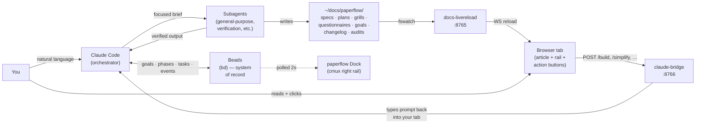
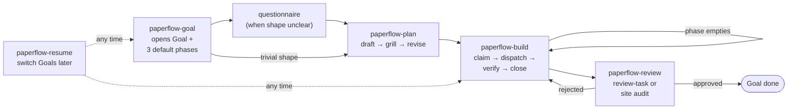
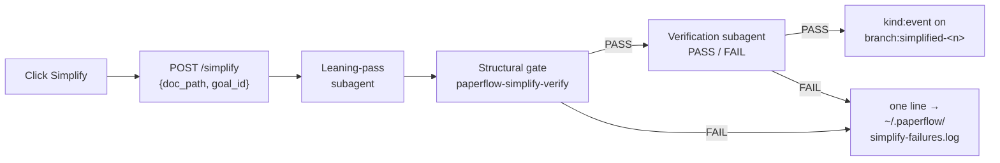

# paperflow

> One Claude Code instance, running as orchestrator, that designs the work, dispatches subagents to do it, and tracks the whole thing in Beads. The artefacts are HTML articles you read in your browser; the buttons on those articles route back into the same Claude session.

paperflow is a workflow, not a chat wrapper. It assumes you give Claude meaningful work — not one-shot questions — and it gives Claude the structure to plan, build, and review that work without losing the thread across sessions. Goals live as long as you need them. Tasks are atomic. Plans get stress-tested before you build. The orchestrator never does long-form work itself; it briefs subagents and synthesises their returns.



The whole loop runs locally on your Mac. No cloud, no telemetry. Two LaunchAgents (or two cmux workspaces), one daemon, six skills, one task store.

---

## Table of contents

- [At a glance](#at-a-glance)
- [Install](#install)
- [The loop](#the-loop)
- [Goals · Phases · Tasks](#goals--phases--tasks)
- [The six skills](#the-six-skills)
- [Beads — the system of record](#beads--the-system-of-record)
- [Goal-path right rail](#goal-path-right-rail)
- [paperflow Dock (cmux)](#paperflow-dock-cmux)
- [Simplify](#simplify)
- [Subagent enforcement](#subagent-enforcement)
- [The bridge](#the-bridge)
- [Live-render server](#live-render-server)
- [Statusline](#statusline)
- [Hooks](#hooks)
- [Authoring docs](#authoring-docs)
- [Repo layout](#repo-layout)
- [Troubleshooting](#troubleshooting)
- [License + credits](#license--credits)

---

## At a glance

- **One orchestrator, many subagents.** The main Claude session keeps context; subagents do the writing, coding, reviewing. Past ~50% context utilisation, model behaviour degrades — paperflow's hard subagent-dispatch rule keeps the ceiling far away.
- **Goals · Phases · Tasks** mapped 1:1 to Beads' hierarchical IDs. `paperflow-a1b2 → .1 pre-flight → .2 build → .2.3 wire-bridge`.
- **Six skills, capped.** `paperflow-{goal,plan,build,review,install,resume}`. CI fails the 7th. A new skill must displace an existing one in the same PR.
- **Article-style HTML docs**, not Markdown — ingress, byline, captioned figures, serif body, Mermaid diagrams throughout. Hot-reload at ~200 ms.
- **Grill loop on every plan.** 8–15 pointed questions with rationale, recommendation, per-question diagram. Mandatory by default; opt-out by name.
- **Goal-path right rail.** Sticky 240 px panel on every doc; Mermaid `gitGraph` of the Goal's lifecycle events; click to jump, shift-click two events to diff.
- **paperflow Dock.** Four feeds in cmux's sidebar: active context, ready tasks, recent events, auto-open log. One Node daemon polls Beads on a 2 s cadence.
- **Simplify.** One-click leaning pass on any plan/spec/grill, gated by a structural check + a verification subagent before it lands as a `branch:simplified-*` event.

---

## Install

```bash
curl -fsSL https://raw.githubusercontent.com/FRIKKern/paperflow/main/scripts/quickstart.sh | bash
```

About a minute. The quickstart clones the repo to `~/Documents/GitHub/paperflow` (or pulls if already there), then runs `install.sh`. Re-run any time to upgrade — idempotent.

### What you get

| Component | Path | Purpose |
|---|---|---|
| `docs-livereload` LaunchAgent | `~/Library/LaunchAgents/dev.<user>.docs-livereload.plist` | Hot reload for `~/docs/` on port 8765 |
| `claude-bridge` LaunchAgent (or cmux workspace) | `~/Library/LaunchAgents/dev.<user>.claude-bridge.plist` | Routes browser button clicks back to your terminal on port 8766 |
| Six skills | `~/.claude/skills/paperflow-{goal,plan,build,review,install,resume}/SKILL.md` | Claude invokes on demand |
| Renderers | `~/docs/paperflow/_lib/{doc,grill,goal-path-rail,live-render,mermaid-zoom,simplify-button,diff-modal,text-diff}.{css,js}` | Per-doc-type buttons, grill forms, the rail, hot-reload, Simplify |
| Hooks | `~/.claude/hooks/{inject-principles,auto-open-doc,validate-paperflow-doc,event-on-save}.sh` | Wired into `~/.claude/settings.json` |
| Statusline | `~/.claude/statusline.sh` + `~/.paperflow/statusline-limits.json` | One-line bottom bar |
| Standing principles | `~/.claude/CLAUDE.md` | Created if missing; opt-in fragments via `--with-*` |
| Helpers | `~/.local/bin/paperflow-{target,validate,bd-init,audit-site,audit-orchestrator-budget,continue,migrate-legacy-goals,dock-daemon,dock-feed}` | Each does one thing |
| Dock daemon | `~/.local/bin/paperflow-dock-daemon` + `~/.paperflow/dock.sock` | Polls Beads on a 2 s cadence; serves the four cmux feeds |
| Dock config | `${XDG_CONFIG_HOME:-$HOME/.config}/cmux/dock.json` | Skip-on-existing; pass `--reset-dock` to overwrite |

### Pre-reqs

| Need | Install |
|---|---|
| Node 22+ | `brew install node` (or `brew install nvm && nvm install 22`) |
| `jq` | `brew install jq` |
| Beads (`bd`) | `brew install beads` or `npm i -g beads` |
| Xcode CLI | `xcode-select --install` |

The installer pre-flights all four. Beads is required — paperflow has no fallback task store. The Beads version baseline is `1.0.3`; below that, some verbs may differ.

### Flags

| Flag | What it does |
|---|---|
| `--with-openclaw` | Append the OpenClaw delegation fragment to `~/.claude/CLAUDE.md`. Verifies `/opt/homebrew/bin/openclaw`; warns (non-fatal) if missing. Does not install OpenClaw. |
| `--with-browserbase` | Append the BrowserBase fragment. No binary check — BrowserBase is a cloud API. |
| `--with-unlighthouse` | Append the Unlighthouse fragment. Offers to `npm i -g @unlighthouse/cli puppeteer` (asks first). |
| `--reset` | Tarball `~/.claude/{CLAUDE.md,hooks,skills}` and `~/.paperflow/` to `~/.paperflow/backups/<ts>.tar.gz`, delete those paths, install fresh. Combine with `--with-*` to pick a new integration set. |
| `--reset-dock` | Overwrite an existing `~/.config/cmux/dock.json` (after backing up to `dock.json.bak.<ts>`). Without this, the install skips a pre-existing dock config. |

Default install (no flags) is lean. `~/.claude/CLAUDE.md` carries only the core paperflow doc; integration prose ships only when the flag is passed.

### Verify

```bash
curl -s http://127.0.0.1:8765/   # docs-livereload — directory listing
curl -s http://127.0.0.1:8766/   # claude-bridge   — "claude-bridge ok"
find ~/.claude/skills -name 'SKILL.md' -path '*paperflow-*' | wc -l   # 6
```

In any **already-running** Claude Code session run `/hooks` once (or restart) so the hooks are picked up. Skills + `CLAUDE.md` require a restart.

---

## The loop



1. **`paperflow-goal`** opens the Goal. Auto-creates three phases (`pre-flight`, `build`, `review`), writes the two pointer files, renders the Goal HTML.
2. **Questionnaire** (when the shape isn't obvious): six categories — scope, constraints, preferences, context, success criteria, open decisions. 5–10 questions with rationale and optional recommendation. Reuses the grill renderer.
3. **`paperflow-plan`** drafts → grills → revises. The plan HTML becomes work-tasks under the active phase via `bd create` + `bd dep add`.
4. **`paperflow-build`** loops: read active phase, `bd ready`, claim, dispatch a subagent with task context, verify evidence, close. When the phase empties, advance the active-phase pointer.
5. **`paperflow-review`** opens a review-task linked to its parent build-task. Approval closes; rejection re-opens the build-task. Site audits live here too.
6. **`paperflow-resume`** mirrors Claude Code's `/resume` — pick a Goal, the pointer flips, the Goal HTML opens via the cmux tab-reuse contract.

---

## Goals · Phases · Tasks

The hierarchy maps 1:1 to Beads' native hierarchical IDs.

| Layer | Beads kind | Example ID | Lives at |
|---|---|---|---|
| Goal  | `kind:goal`  | `paperflow-a1b2`     | top-level Beads task |
| Phase | `kind:phase` | `paperflow-a1b2.2`   | child of the goal-task |
| Task  | (work-task)  | `paperflow-a1b2.2.3` | child of the phase-task |
| Event | `kind:event` | `paperflow-a1b2.evt` | sidecar history; hidden from default `bd list`/`bd ready` |

Two pointer files in `<repo>/.paperflow/` say what's active in this checkout:

```
<repo>/.paperflow/active-goal     # one line: paperflow-a1b2
<repo>/.paperflow/active-phase    # one line: paperflow-a1b2.2
```

Lookup walks up from cwd to the nearest `.paperflow/`. With neither file present anywhere up to `/`, paperflow has no active goal/phase. Both pointers are written by `paperflow-goal` (on open) and `paperflow-resume` (on switch). `paperflow-build` advances `active-phase` when the current phase empties.

A second mirror at `~/.paperflow/active-goal` exists for hooks that fire from `~/docs/paperflow/...` (where the dev repo isn't reachable up the directory tree).

---

## The six skills

Six, exact. `scripts/check-skill-count.sh` fails CI if a 7th lands without a displacement.

| Skill | One-line purpose |
|---|---|
| `paperflow-goal` | Open / refresh / archive a Goal — creates the goal-task, three default phases, both pointer files, renders the Goal HTML. Snapshot and archive are sub-actions of the same skill. |
| `paperflow-plan` | The signature paperflow move — draft a plan, grill it with 8–15 pointed questions, revise. Materialises plan steps as Beads work-tasks under the active phase. Simplify is a sub-action here. |
| `paperflow-build` | Claim the next ready task in the active phase, dispatch a subagent, verify on return, close. Loop the phase, advance when empty. TDD / parallel agents / worktrees are opt-in modes; verification-before-completion is always on. |
| `paperflow-review` | Open a review-task linked to a build-task; delegate the review (or site audit) to a subagent. Approval closes; rejection re-opens the build-task. Includes a Subagent-Run audit on the build-phase commits. |
| `paperflow-install` | The meta-skill. Install / upgrade / reset, integration opt-in (`--with-openclaw/--with-browserbase/--with-unlighthouse`), authoring a new SKILL.md (subject to the 6-skill cap), writing paperflow's own release changelogs. The "what is paperflow?" entry point. |
| `paperflow-resume` | Mirrors Claude Code's `/resume` for Goals. Lists Goals via Beads, presents a numbered menu, flips the two pointers on pick, surfaces unfinished questionnaires. Read-only on Beads. |

Each non-exempt skill carries an inlined copy of `lib/shared-thresholds.md` between `<!-- BEGIN paperflow-thresholds -->` / `<!-- END paperflow-thresholds -->` sentinels. `install.sh` re-splices on every run. `paperflow-resume` is exempt (read-only).

---

## Beads — the system of record

paperflow uses Beads (`bd`) as the single source of truth for goals, phases, tasks, and events. No JSON sidecars, no parallel state.

```bash
brew install beads        # macOS
npm i -g beads            # cross-platform
```

Per-repo init: `paperflow-bd-init` runs `bd init` once on the first Goal in a repo. `paperflow-build` claims with `bd update <id> --claim` and closes with `bd update <id> --close`. `bd ready --label goal-<slug> --label phase-<active>` returns the next ready work-task within the active phase.

### Label conventions

| Label | Meaning |
|---|---|
| `kind:goal` | Goal-task. One per Goal. |
| `kind:phase` | Phase-task. Three per default Goal (pre-flight, build, review). |
| `kind:event` | Sidecar event in the goal-path rail. Hidden from default `bd list`/`bd ready` via `~/.beads/aliases.toml` blocks the installer appends. |
| `goal-<slug>` | Every task descends a Goal — work-tasks, phase-tasks, events all carry this. |
| `phase-<name>` | Phase scoping — e.g. `phase-build`. Used by `bd ready --label`. |
| `branch:main` / `branch:alt-<n>` / `branch:simplified-<n>` | Branch markers on rail events. |
| `event:<name>` | The lifecycle event type (`event:goal-opened`, `event:plan-written`, etc.). |
| `source:<rel-path>` | Doc the event was emitted from; powers `?source=` lookup. |

To peek at events anyway: `bd list --label kind:event`. On Beads versions that don't honour the alias file, that flag is the documented fallback.

---

## Goal-path right rail

Every paperflow doc loaded with an active Goal in scope renders a 240 px sticky right rail showing the Goal's lifecycle as a Mermaid `gitGraph`. The rail tracks **events**, not doc revisions: `goal-opened`, `questionnaire-written`, `questionnaire-answered`, `plan-written`, `plan-grilled`, `phase-advanced`, `goal-snapshot`, `goal-closed`, `simplified-*`. Events live as `kind:event` Beads tasks parented to the goal-task, with HTML payloads at `~/.paperflow/events/<event-task-id>.html`.

Two ways to find the Goal for a given doc:

- `GET /goal-path?goal=<id>` — explicit, when the page sets `window.PAPERFLOW_GOAL_ID`.
- `GET /goal-path?source=<rel-path>` — fallback, walks events with `source:<rel-path>` and returns the latest one's goal id.

`GET /event/<id>` serves the sidecar payload. `GET /diff?from=<id>&to=<id>` returns a line-level diff via `lib/text-diff.js` (vendored — no CDN, no jsdiff).

**Walk-back.** Click an older event in the rail; `lib/goal-path-rail.js` writes its id to `<repo>/.paperflow/active-event-base`. The next save reads the pointer, parents the new event there, and lands it on a fresh `branch:alt-<n>`. The hook clears the pointer afterwards. Shift-click two distinct nodes to open the diff modal.

**Cross-doc lineage.** When a doc carries `<meta name="paperflow-spawned-from" content="<rel-path>">`, the rail shows `↳ from <basename>` at the top. One level only — no transitive chain.

Per-page opt-out: `<script>window.PAPERFLOW_NO_RAIL = true;</script>` before the `doc.js` include.

---

## paperflow Dock (cmux)

cmux exposes a right-side Dock; paperflow puts four live feeds in it, surfacing the orchestrator's working memory.

| Feed | What it shows |
|---|---|
| `active-context` | Active Goal, active Phase, currently claimed Task |
| `bd-ready` | Top of `bd ready --label phase-<active>` (priority + title) |
| `goal-path` | Recent `kind:event` rows for goal+phase, sorted desc |
| `auto-open-log` | Tail of `~/.paperflow/auto-open.log` |

A single Node daemon (`~/.local/bin/paperflow-dock-daemon`, no deps) polls Beads on a 2 s internal cadence, caches the four feeds, and serves them on a UNIX socket at `~/.paperflow/dock.sock`. Each Dock pane runs `watch -n 5 paperflow-dock-feed <name>`; the client is ~15 LOC of bash that `nc -U`s the socket and prints. PID file at `~/.paperflow/dock-daemon.pid`.

Config lives at `${XDG_CONFIG_HOME:-$HOME/.config}/cmux/dock.json`. Skip-on-existing default; `bash install.sh --reset-dock` overwrites (after backing up).

```bash
paperflow-dock-feed active-context        # query directly
cat ~/.paperflow/dock-daemon.pid          # PID file (0 bytes if down)
tail /tmp/paperflow-dock-daemon.log       # non-cmux stderr
kill $(cat ~/.paperflow/dock-daemon.pid)  # graceful shutdown
bash install.sh                           # respawns daemon
```

---

## Simplify

Every plan, spec, and grill HTML carries a **Simplify** button. One click runs a leaning-pass subagent against the doc; the candidate goes through a two-tier verification gate before it lands as a new event on `branch:simplified-<n>` in the goal-path rail. The original is always one click-jump away.



The gate is the never-worse guarantee — Mermaid figures, H2 hierarchy, bound decisions, and outbound URLs must all survive. **Trim categories** the leaning pass attempts: verbose phrasing, redundancy, example bloat, low-signal sub-bullets, hedging words. **Never cut**: Mermaid figures, H2 headings, bound decisions, outbound URLs, the ingress.

When a `branch:simplified-*` node is selected on the rail, Accept calls `POST /simplify/accept` (bridge writes the simplified payload back to the source HTML and relabels the event to `branch:main`); Reject calls `POST /simplify/reject` with an optional reason. The source HTML on disk is unchanged until the user explicitly accepts.

Implementation lives in `paperflow-plan` as a sub-action — no new skill, the 6/6 cap holds.

---

## Subagent enforcement

paperflow's orchestrator follows a hard subagent-dispatch rule with concrete numeric thresholds and a structured commit-message marker. The single source of truth lives at `lib/shared-thresholds.md`; each non-exempt skill carries an inlined copy refreshed on every `bash install.sh` run.

**Hard thresholds — above ANY of these, the orchestrator MUST dispatch a subagent:**

- **> 30 LOC** of new code (across all files in one logical unit)
- **> 50 lines** of new prose / markdown
- **> 500 tokens** of raw tool output captured / synthesised

Bash glue ≤ 25 LOC stays inline; other languages hold the 30 LOC gate. Beads bookkeeping, pointer-file writes, single-line edits, and verbatim subagent output are exempt — see the full carve-out list in `lib/shared-thresholds.md`.

**Pre-write checkpoint.** Before any inline `Write` / `Edit` over threshold, the orchestrator prints a one-line justification:

```
Doing inline because: <reason>. Above threshold would be <subagent-reason>.
```

**Verification subagent.** When a build subagent returns more than 500 tokens of evidence, `paperflow-build` dispatches a SECOND subagent — a verification-subagent — which returns `PASS:` / `FAIL:` only. The orchestrator never absorbs raw evidence.

**Commit-message marker.** Any commit touching > 30 LOC includes a structured trailer:

```
Subagent-Run: <task-id>
```

`bin/paperflow-audit-orchestrator-budget` flags over-threshold commits that lack this trailer. `paperflow-review` runs the audit on every review-task; the reviewer must justify or re-open.

---

## The bridge

`claude-bridge` is a tiny Node HTTP server on `localhost:8766`. Browser buttons POST `{target, message}` (or richer payloads) to one of the endpoints; the bridge dispatches into the originating terminal tab.

| Endpoint | Purpose |
|---|---|
| `GET /` | Liveness ping |
| `POST /build` | Dispatch a message into the originating terminal (tmux / iTerm / Apple Terminal / cmux) |
| `POST /marker` | Questionnaire-answered sidecar; also fires `event:questionnaire-answered` when an active goal is known |
| `GET /goal-path?goal=<id>` | Goal-path event subtree for the rail |
| `GET /goal-path?source=<rel>` | Resolve goal id by latest `source:<rel>` event |
| `GET /event/<task-id>` | Sidecar payload for one event-task |
| `POST /event` | Create a `kind:event` Beads task + sidecar |
| `POST /event/active` | Write `<repo>/.paperflow/active-event-base` (walk-back pointer) |
| `GET /diff?from=<id>&to=<id>` | Bridge-side line-level diff between two events |
| `POST /simplify` | Kick off a leaning-pass + verification job; returns `{ok, job_id}` |
| `GET /simplify/status?job=<id>` | Poll a Simplify job |
| `POST /simplify/accept` | Promote a `simplified-<n>` event to `branch:main`, overwrite source HTML |
| `POST /simplify/reject` | Close a `simplified-<n>` event with a reason |

The bridge supports tmux (any host), iTerm2 (`write text`), Apple Terminal (`do script in tab`), and cmux (`cmux send --workspace … --surface …`). Targeting JSON is captured at write-time by `~/.local/bin/paperflow-target` and embedded in the doc as `window.CLAUDE_TARGET`.

### cmux trust pitfall

On cmux.app systems the bridge **cannot** run as a LaunchAgent. cmux's socket is in access mode `cmuxOnly` and rejects connections whose responsible-process ancestor is `launchd`, returning `Failed to write to socket (Broken pipe)` on every dispatch. The bridge must be a child of `cmux.app` to inherit the trust cmux's auth requires.

`install.sh` detects cmux (`$CMUX_SOCKET` + `$CMUX_BUNDLED_CLI_PATH`), tears down any legacy LaunchAgent, and spawns the bridge with:

```bash
cmux new-workspace --name paperflow-bridge --command "node $REPO/bin/claude-bridge.js"
```

If the bridge ever shows broken-pipe in the logs and you've recently switched terminals into cmux, re-run `bash install.sh` — it'll detect the environment and re-spawn correctly. Same contract holds for the Dock daemon.

---

## Live-render server

`docs-livereload` is a `live-server@1.2.2` LaunchAgent serving `~/docs/` on port 8765 with WebSocket hot reload (~200 ms refresh). Every paperflow HTML loads `live-render.js` via `doc.js`; on file change, the client morphs the DOM in-place — scroll position is preserved, rendered Mermaid diagrams survive.

Live-render short-circuits when `location.hostname` isn't `localhost` / `127.0.0.1` / `::1`, so printed PDFs, emailed copies, and USB exports never try to open a WebSocket they can't reach. To opt out from a specific page (e.g. a fixed-snapshot demo):

```html
<script>window.PAPERFLOW_NO_LIVE_RENDER = true;</script>
```

…before the `doc.js` include.

The version is pinned because newer pre-release builds have a known WebSocket-init regression that breaks the WS-intercept the live-render client relies on.

---

## Statusline

When `<repo>/.paperflow/active-goal` exists, the bottom-bar statusline shows the goal slug, the active phase + position in the phase sequence, and the currently claimed Task with progress through the active phase:

```
137,420 / 1M · 1209d022 · onboarding-revamp · ▸ phase 2/3: build · ▸ paperflow-a1b2.2.3 wire-bridge · 4/9 · main
```

The statusline composes from a pre-rendered cache at `~/.paperflow/statusline.txt` (written by every Beads-mutating skill on claim/close); when stale, it falls through to live composition via `bd show / bd list --json`. Width-driven truncation drops phase first below 120 cols, then the task subsegments, then branch, project, session-id, in that order. Tokens always survive.

`STATUSLINE_DEBUG=1` mirrors every render to `~/.paperflow/statusline-debug.log` (rotates at 5 MB to `.log.1`).

To add a new model's context-window limit, edit `~/.paperflow/statusline-limits.json` directly. The installer never overwrites a user-edited limits file — it tracks shipped versions via `~/.paperflow/.statusline-limits-installed-sha`.

---

## Hooks

Wired into `~/.claude/settings.json` by `install.sh`:

| Hook | Event | Purpose |
|---|---|---|
| `inject-principles.sh` | `UserPromptSubmit` | Re-inject standing principles every turn — bloat-resistant against context drift. |
| `auto-open-doc.sh` | `PostToolUse(Write\|Edit)` | Open any spec/plan/grill/note/Goal HTML you write. cmux de-dupes by URL: same URL refocuses the existing tab; different URL opens a new one. Logs to `~/.paperflow/auto-open.log`. |
| `validate-paperflow-doc.sh` | `PostToolUse(Write\|Edit)` | Run `paperflow-validate` on any paperflow doc HTML; surface Mermaid syntax errors as a `<system-reminder>` so Claude fixes them before reporting the URL. Iterates up to 3 times. |
| `event-on-save.sh` | `PostToolUse(Write\|Edit)` | Emit a `kind:event` Beads task + sidecar HTML when a paperflow doc is saved. Walks up to find the active Goal; falls back to the global `~/.paperflow/active-goal` mirror when the doc lives under `~/docs/paperflow/`. |

In any **already-running** Claude Code session, run `/hooks` once after install (or restart) so hooks are picked up.

---

## Authoring docs

Specs, plans, grills, questionnaires, Goal HTML, and changelogs are standalone HTML articles — not Markdown. Article-style typography (eyebrow, ingress, byline, captioned figures, serif body, sans headings) lives in the shared stylesheet:

```html
<link rel="stylesheet" href="/paperflow/_lib/doc.css">
```

End every doc with:

```html
<script>
  window.CLAUDE_TARGET     = /* paste output of ~/.local/bin/paperflow-target */;
  window.DOC_PATH          = "<this-filename>.html";
  window.PAPERFLOW_GOAL_ID = "<goal-id>";   /* required for the rail */
</script>
<script src="/paperflow/_lib/doc.js"></script>
```

`doc.js` reads the URL path and auto-injects the right buttons:

| URL contains | Primary button | Secondary |
|---|---|---|
| `/specs/` | Create plan from this spec | Grill the spec |
| `/plans/` | Build this plan | Grill the plan |
| `/grills/`, `/questionnaires/` | Submit (handled by `_lib/grill.js`) | — |
| `/goals/` | Snapshot, Archive | — |
| `/changelog/` | Share | — |

Distribute Mermaid diagrams throughout — every section explaining a flow, comparison, or decision gets one. Aim for at least one figure per ~300 words. Always open via the live-reload URL, never `file://`:

```bash
open http://localhost:8765/paperflow/specs/<filename>.html
```

Canonical references in the repo:

- [`examples/openclaw-spec.html`](./examples/openclaw-spec.html) — the spec shape
- [`examples/openclaw-grill.html`](./examples/openclaw-grill.html) — the grill form
- [`examples/example-questionnaire.html`](./examples/example-questionnaire.html) — questionnaire shape; copy this as the starting template

### Doc validation (mandatory)

Every paperflow doc write runs through `paperflow-validate` automatically — a PostToolUse hook fires on Write/Edit of any HTML under `~/docs/paperflow/{specs,plans,grills,questionnaires,notes,changelog,goals,audits}/`, parses every Mermaid block (both `<pre class="mermaid">` and grill-style JS-literal `diagram:` strings), and surfaces failures as a `<system-reminder>`. Iterates up to 3 times.

---

## Repo layout

```
paperflow/
├── README.md                       # this file
├── INSTALL.md                      # install.sh details, manual install, uninstall
├── LICENSE                         # MIT
├── THIRD-PARTY-CREDITS.md          # obra/superpowers + Beads attribution
├── install.sh                      # idempotent installer
├── uninstall.sh                    # reverse it
├── claude-md.tmpl                  # template for ~/.claude/CLAUDE.md
├── claude-md-fragments/            # opt-in fragments
│   ├── browserbase.md
│   ├── openclaw.md
│   └── unlighthouse.md
├── bin/
│   ├── claude-bridge.js            # the bridge service
│   ├── get-terminal-target.sh      # captures CLAUDE_TARGET JSON
│   ├── paperflow-bd-init           # per-repo Beads bootstrap
│   ├── paperflow-validate          # static Mermaid check (~80 LOC Node)
│   ├── paperflow-audit-site        # Unlighthouse wrapper
│   ├── paperflow-audit-orchestrator-budget   # Subagent-Run trailer audit
│   ├── paperflow-continue          # mission-launcher (carry-over)
│   ├── paperflow-migrate-legacy-goals
│   ├── paperflow-simplify-verify   # Simplify structural gate
│   ├── paperflow-dock-daemon       # the 2 s poller
│   └── paperflow-dock-feed         # ~15 LOC bash client
├── lib/
│   ├── doc.{css,js}                # per-doc-type buttons
│   ├── grill.{css,js}              # form rendering + submit-back (also questionnaires)
│   ├── goal-path-rail.{css,js}     # right-rail renderer
│   ├── live-render.{css,js}        # DOM-morph hot-reload
│   ├── mermaid-zoom.{css,js}       # click-to-zoom modal
│   ├── simplify-button.js          # Simplify trigger
│   ├── diff-modal.js               # shift-click diff overlay
│   ├── text-diff.js                # vendored line-level diff (no jsdiff, no CDN)
│   ├── shared-thresholds.md        # source of truth for subagent thresholds
│   ├── simplify-{leaning-pass,verification}-brief.md
│   ├── statusline.sh               # one-line bottom bar
│   ├── statusline-limits.json      # editable model context-window limits
│   └── dock.json.tmpl              # cmux Dock config template
├── hooks/
│   ├── inject-principles.sh        # UserPromptSubmit
│   ├── auto-open-doc.sh            # PostToolUse(Write|Edit)
│   ├── validate-paperflow-doc.sh   # PostToolUse(Write|Edit)
│   └── event-on-save.sh            # PostToolUse(Write|Edit)
├── skills/
│   └── paperflow-{goal,plan,build,review,install,resume}/SKILL.md
├── launchagents/
│   ├── claude-bridge.plist.tmpl
│   └── docs-livereload.plist.tmpl
├── scripts/
│   ├── quickstart.sh               # the curl one-liner
│   └── check-skill-count.sh        # CI gate, 6-skill cap
├── examples/
│   ├── openclaw-spec.html
│   ├── openclaw-grill.html
│   └── example-questionnaire.html
└── tests/
    ├── dock-smoke.sh               # daemon + feed smoke test
    ├── dock/fixtures/
    ├── statusline/{run.sh, fixtures, mock-bd-bin, transcripts}/
    └── text-diff/test.js
```

---

## Troubleshooting

| Symptom | Likely cause | Fix |
|---|---|---|
| Browser shows `file://` URL, not `localhost` | Auto-open hook didn't fire | Run `/hooks` once or restart the session |
| Click button → "✗ Failed" / broken pipe under cmux | Bridge running as LaunchAgent — cmux rejects the dispatch | `bash install.sh` — detects cmux, re-spawns the bridge as a cmux workspace |
| Click button → nothing happens | Bridge down | LaunchAgent: `launchctl kickstart -k gui/$(id -u)/dev.<user>.claude-bridge`. cmux: open the `paperflow-bridge` workspace |
| Live reload not refreshing | live-server LaunchAgent down | `launchctl kickstart -k gui/$(id -u)/dev.<user>.docs-livereload` |
| `bash install.sh` says EACCES on `npm install -g` | Homebrew root-owns `/usr/local/lib/node_modules` | The installer pre-flights this and prints the two fixes. TL;DR either `sudo chown -R $(whoami) $(npm config get prefix)/{lib/node_modules,bin,share}`, or `npm config set prefix ~/.npm-global` and add it to PATH |
| `bash install.sh` says "Node v22+ not found" | nvm not loaded in non-interactive shell | `nvm install 22 && nvm use 22 && bash install.sh` or `brew install node` |
| Statusline empty in a Goal-active repo | Cache stale and live composition failed | Run any Beads-mutating action (claim/close); cache rewrites |
| Dock panes show "paperflow-dock daemon down" | Daemon not running | `bash install.sh` — daemon liveness is probed via `~/.paperflow/dock.sock`; respawns if unresponsive |
| Goal-path rail empty on a fresh doc | Doc didn't set `window.PAPERFLOW_GOAL_ID` | Add the inline script before the `doc.js` include; rail falls back to `?source=` resolution but is silent on docs that haven't generated events yet |
| `paperflow-validate` keeps failing on the same Mermaid block | Inline HTML inside Mermaid, or an unbalanced quote in a `diagram:` literal | Read the validator's failure JSON — it points at the line and shows the offending excerpt |

Logs:

```
~/.local/log/docs-livereload.{out,err}.log
~/.local/log/claude-bridge.{out,err}.log
/tmp/paperflow-dock-daemon.log               # non-cmux stderr
~/.paperflow/auto-open.log                   # auto-open events (rotates at 1 MB)
~/.paperflow/simplify-failures.log           # rejected Simplify candidates
~/.paperflow/questionnaire-skips.log         # skipped questionnaires
```

---

## License + credits

MIT — see [LICENSE](./LICENSE).

paperflow draws on patterns from `obra/superpowers` (MIT) — `paperflow-plan` adapts `writing-plans` and `brainstorming`; `paperflow-build` adapts `executing-plans`, `verification-before-completion`, `subagent-driven-development`, `dispatching-parallel-agents`, `using-git-worktrees`, `systematic-debugging`; `paperflow-review` adapts `requesting-code-review`, `receiving-code-review`, `finishing-a-development-branch`; `paperflow-install` adapts `writing-skills` and the entry-point `using-superpowers` shape. Where a section is structurally identical to an upstream skill, an inline note in the SKILL.md points back to [THIRD-PARTY-CREDITS.md](./THIRD-PARTY-CREDITS.md).

paperflow uses [Beads](https://github.com/gastownhall/beads) (MIT) as the system of record. Beads is invoked as a runtime dependency — paperflow does not bundle, redistribute, or modify it.
