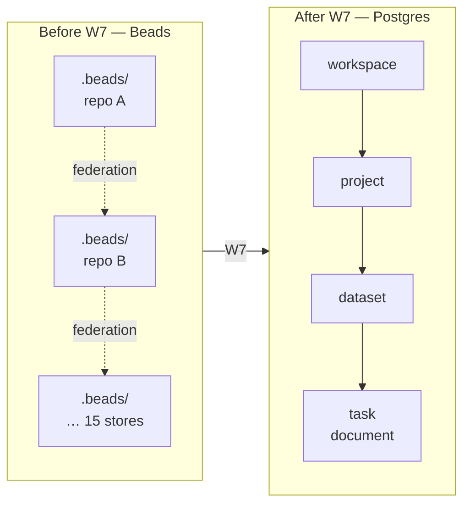
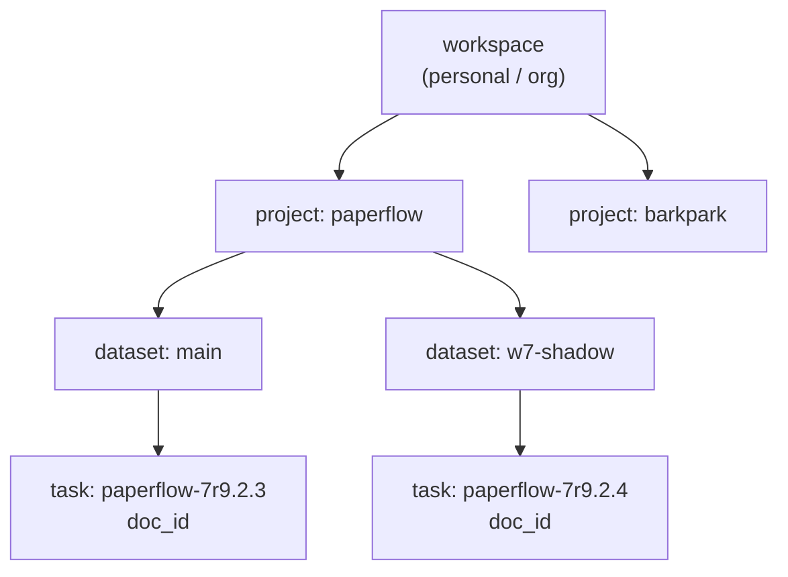

# ADR — Task topology: tasks live inside dataset, inside project, inside workspace

- **Status:** Accepted (locked by W7 plan Q1, ratified by W7d ship)
- **Date:** 2026-05-28
- **Supersedes:** —
- **Owners:** paperflow / barkpark
- **Related plan:** [`~/docs/paperflow/plans/2026-05-24-w7-retire-beads-plan.html`](http://localhost:8767/paperflow/plans/2026-05-24-w7-retire-beads-plan.html) (Q1)

---

## Context

For its whole lifetime up to W7, paperflow's task layer lived in Beads (`bd`) — a flat, per-repo Dolt store under `<repo>/.beads/`. Beads has no tenancy: a Beads database is single-tenant by construction, and isolation between repos rode on the filesystem boundary (one `.beads/` per checkout, 15 of them federated over `refs/dolt/data`). Inside any one store every task sat in one flat namespace; goals and phases were only labels on tasks.

W7 retires Beads and moves tasks into the Barkpark document substrate that already shipped — Postgres-backed, with a strict `workspace → project → dataset → document` hierarchy enforced at the schema level. The moment we stop being per-repo-flat-stores and start being one Postgres table, **where do tasks live in the tenancy tree?** becomes a real question with no default answer. Q1 of the W7 plan grill is that question; this ADR records the resolution so the answer survives the plan's eventual archive.

*Figure 1.* Before W7 every repo carried its own Beads store and isolation rode on the filesystem. After W7 there is one Postgres store; tasks must pick a position in the existing four-level tenancy tree.

## Decision

**Tasks are documents inside a dataset, inside a project, inside a workspace.** Per-repo isolation becomes per-project, not per-store. There is one global Postgres task-store; isolation is a tenancy concern, not a federation concern.

The plan considered four alternatives and rejected three:

| # | Topology | Why rejected |
|---|---|---|
| **A** | **Inside dataset, inside project, inside workspace** | **Chosen.** Reuses the shipped tenancy primitives end-to-end. No new ACL surface. Task isolation reuses the same row-level scoping every other document already gets. |
| B | Flat `tasks` table under workspace (no project, no dataset) | Bypasses the substrate's enforced hierarchy. Forces a parallel ACL story just for tasks. Loses the natural per-repo split that maps 1-to-1 onto project. |
| C | Per-tenant federated bd-stores (one Postgres-backed `.beads`-style store per project) | Keeps the federation cost — multiple stores, multiple schemas, cross-store joins — and gives up the central read paths the goal-path rail / dock / statusline now depend on. Q1's whole point is to retire that federation. |
| D | New task-only top-level namespace (sibling of workspace) | Introduces a fifth tenancy level for one document kind. Doubles the orchestrator's "which scope am I in?" surface. Has no countervailing benefit — tasks are not more global than other documents. |

The chosen nesting also makes the import (W7d) trivially classifiable: every Beads task is born in a `.beads/` directory that already sits inside a repo, the repo maps to a project, and the project sits inside one of the user's workspaces. No fuzzy matching, no orphan bucket.

*Figure 2.* The chosen nesting, populated with a concrete example. Per-repo isolation lives at the project level; per-checkout / per-shadow / per-experiment isolation lives at the dataset level; cross-workspace separation is the existing tenancy boundary.

## Consequences

**Enables.**

- **Task isolation per dataset.** Two checkouts of the same repo on different datasets see disjoint task graphs without any new mechanism.
- **Tenancy ACLs are free.** The workspace/project/dataset ACL the substrate already enforces covers tasks unchanged. No "task-only" permission surface.
- **Task IDs unique per dataset namespace.** `paperflow-7r9.2.3` is a `doc_id` that's globally unique in Postgres; collisions between projects are structurally impossible.
- **Importer classifies per-store.** Each Beads store maps cleanly to one `(workspace, project, dataset)` triple — no orphan bucket, no ambiguity.
- **One read path.** Goal-path rail, dock feeds, statusline, and `bd ready` all hit the same Postgres table; the read fan-out that federation forced is gone.

**Costs.**

- **No cross-workspace task graph view.** A user with two workspaces sees two disjoint task graphs. There is no global "all my tasks" query without explicit cross-workspace fan-out at the application layer.
- **Cross-dataset task references are illegal.** Dependencies (`task_edges`) cannot cross dataset boundaries. The shipped substrate enforces this; tasks inherit the rule.
- **Implicit-not-enforced before.** The `w7-13` orphan-task work surfaces exactly the places where this nesting was assumed in code but not enforced by the store. Those locations need explicit scoping inserted as part of W7d.

## Related decisions

- **Q2 — atomic claim & ready-queue.** `SELECT … FOR UPDATE SKIP LOCKED` + advisory locks + expected-rev CAS. The Q1 nesting is what makes the advisory-lock key (`hashtext('goal:'||$slug)`) safely unique — `goal:` slugs are scoped to a dataset.
- **Q5 — active-stores-only import.** The importer only walks Beads stores under active projects/datasets. Q1's project mapping is the discriminator.
- **Q9 — sub-wave split (W7a → W7d).** Q1 lands in W7a as the schema decision; W7d (this ADR) is the record-of-decision step.
- **Q1 — this decision.** Recorded here so the answer survives the plan's archive.

## Cross-references

- W7 plan, Q1 section: [`~/docs/paperflow/plans/2026-05-24-w7-retire-beads-plan.html#sec-1`](http://localhost:8767/paperflow/plans/2026-05-24-w7-retire-beads-plan.html#sec-1)
- W7 plan, grill table row Q1: same doc, top-of-page grill summary table.
- ARCHITECTURE.md → "Task topology" subsection (one-paragraph summary + link back here).
