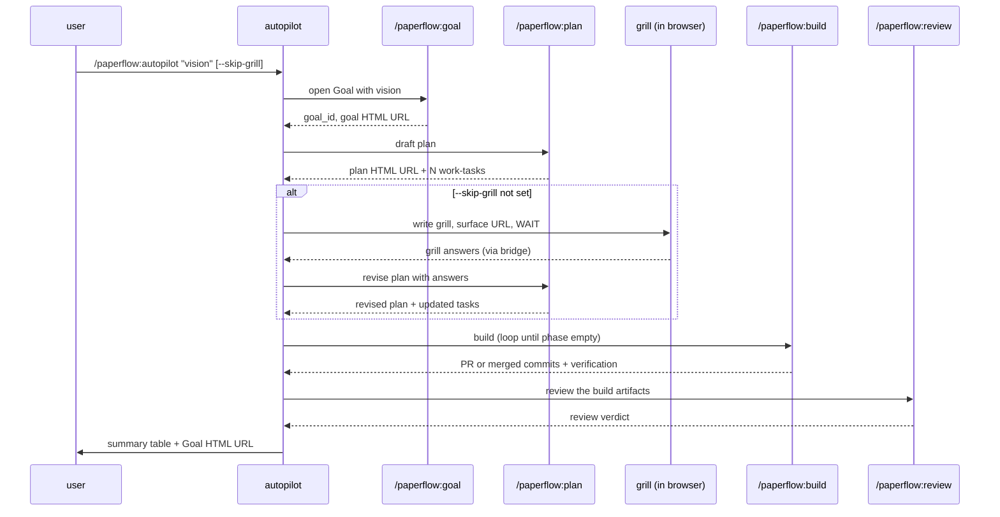

# autopilot

paperflow's momentum mode. Type `/paperflow:autopilot "<one-line vision>"` and paperflow chains the lifecycle: opens a Goal, drafts a plan, fires the grill, waits for your answers in browser, revises, builds the build-phase task by task, runs review, and stops. Every phase writes an HTML article you read in the browser as the run unfolds — the transparency contract is preserved end to end.

This skill is NOT a replacement for the explicit `goal → plan → build → review` path. It is a thin orchestrator that composes those existing skills in order, on the same Goal/Phase/Task data structure, using the same thresholds and hooks. The explicit surface stays primary because that is where the user learns paperflow's mental model. Autopilot is for users who already know the model and want to skip the typing. The full design is in `~/docs/paperflow/notes/2026-05-10-omc-research-and-autopilot.html` — that note is the spec; this SKILL.md is the implementation.

<!-- BEGIN paperflow-thresholds -->
## Subagent enforcement (paperflow-thresholds v1)

paperflow's orchestrator delegates non-trivial work to subagents. The rule has hard thresholds and a pre-write checkpoint — not just guidance.

**Hard thresholds** — above ANY of these, the orchestrator MUST dispatch a subagent:

- **> 30 LOC** of new code (across all files in one logical unit)
- **> 50 lines** of new prose / markdown
- **> 500 tokens** of raw tool output captured / synthesised

**Bash-glue carve-out**: bash glue scripts ≤ **25 LOC** stay inline. Other languages (JS, Python, etc.) hold the 30 LOC gate.

**Pre-write checkpoint**: before any inline `Write` or `Edit` of more than 30 LOC of code OR 50 lines of prose, the orchestrator prints a one-line justification:

    Doing inline because: <reason>. Above threshold would be <subagent-reason>.

Visible self-correction, not silent inlining.

**Recursion depth = 1**: subagent briefs themselves are orchestrator-direct, no matter their length. The orchestrator can write a 600-token brief without dispatching to write the brief — otherwise infinite recursion.

**Verification-subagent dispatch**: when a subagent returns artifacts > 500 tokens of evidence (diffs, test output, screenshots), `/paperflow:build` dispatches a SECOND subagent — a verification-subagent — to inspect the evidence and confirm the gate passes. The orchestrator only sees a one-line verdict.

**Commit-message marker**: any commit touching > 30 LOC includes a structured trailer:

    Subagent-Run: <task-id>

`bin/paperflow-audit-orchestrator-budget` flags over-threshold commits that lack this trailer.

**Always orchestrator-direct (exempt list)** — never dispatch a subagent for:

- Beads bookkeeping (`bd create / claim / close / update --description`)
- Pointer-file writes (`<repo>/.paperflow/active-{goal,phase}`)
- `Read` (always free)
- Short verification commands (`curl` probes, `find … | wc -l`, single-shot greps)
- Single-line edits to live docs to bump pointers / status
- Snapshot writes that change ≤ 5 lines of an existing HTML
- `bd` comments and `bd update --description` (any size)
- Pasting verbatim subagent output (the subagent already did the work)
- Bash glue scripts ≤ 25 LOC (carve-out above)

When in doubt, dispatch.
<!-- END paperflow-thresholds -->

## Step 0 — Runtime preflight + doctor

Before doing anything else, validate that the message-carrying runtime is up and the install is healthy.

**1. Runtime probe.**

    ~/.local/bin/paperflow-preflight

Non-zero → abort the skill and paste the JSON from stdout to the user verbatim. The JSON carries `service`, `mode` (`cmux` or `launchagent`), `repair_command`, and `log_tail` — the user runs the repair, then re-invokes the skill.

**2. Doctor (deps + version + integrity).**

    ~/.local/bin/paperflow-doctor --fast

Read the JSON from stdout and react by exit code:

| Exit | Meaning | Action |
|---|---|---|
| 0 | Clean | Continue silent. |
| 1 | Warnings (outdated, optional dep missing, drift already auto-fixed) | Continue. Print a one-line summary at the start of the skill's main work: `Doctor: N warning(s) — run paperflow-doctor --full to inspect.` |
| 2 | Critical (bd/node missing, settings.json corrupted) | Abort. For each issue with `auto_fix_safe:false`, surface the `repair_command` and ask the user with `AskUserQuestion` whether to run it. |

## Step 0.5 — Doc metadata

All sub-skills you invoke (`/paperflow:goal`, `/paperflow:plan`, `/paperflow:review`) handle Step 0.5 themselves by calling `~/.local/bin/paperflow-doc-meta` before writing each HTML. You don't need to call it directly.

## Process

The orchestration is a thin chain over existing skills. Each numbered step below maps to one arrow in the diagram. Autopilot calls each `/paperflow:*` skill the same way Claude resolves any other slash invocation — natural orchestration through the skills surface, not bundled agents and not shell-out.

1. **Parse args.** Strip flags first, then collect the remainder as the vision string. Required: a non-empty vision after stripping flags. If empty, abort with: `autopilot needs a one-line vision — e.g. /paperflow:autopilot "rewrite onboarding"`. Recognised flag: `--skip-grill` (boolean).

2. **Open the Goal.** Invoke `/paperflow:goal "<vision>"`. The goal skill picks a slug, creates the goal-task + three default phase-tasks, writes both pointer files, renders the Goal HTML. Capture `$GOAL_ID` and the Goal HTML URL. Surface the URL to the user before continuing — they should be able to watch the run in browser.

3. **Draft the plan.** Invoke `/paperflow:plan` for the active phase (which the goal skill set to `pre-flight` on open; the plan skill operates against the active phase pointer). The plan skill's draft sub-action writes the plan HTML and materialises N work-tasks under the build-phase. Capture the plan HTML URL.

4. **Grill (mandatory unless `--skip-grill`).** If the flag is NOT set, trigger the plan skill's grill phase against the freshly-drafted plan. The plan skill writes the grill HTML to `~/docs/paperflow/grills/<date>-<slug>.html` and the auto-open hook surfaces it. **STOP and wait.** The user fills the form in browser; on submit, `lib/grill.js` POSTs to the bridge which delivers a message of the form `Grill answers for <plan>:` into the originating terminal. Autopilot resumes from that inbound message — there is no polling.

5. **Revise the plan.** Once the grill answers arrive, invoke `/paperflow:plan` again with the revise sub-action against the captured answers. The plan skill rewrites the plan HTML and updates / re-orders work-tasks.

6. **Build the build-phase.** Invoke `/paperflow:build`. The build skill's own loop claims the next ready task, dispatches an executor subagent, runs the verification-subagent on returned evidence, closes the work-task, and repeats until the active phase is empty. Autopilot does not loop — it kicks off `/paperflow:build` and waits for it to drain the phase. All existing build gates (PR creation rules, hooks, threshold enforcement) hold unchanged.

7. **Advance to review.** When the build phase empties, the build skill itself advances `<repo>/.paperflow/active-phase` to the review phase. Confirm the pointer landed (`cat <repo>/.paperflow/active-phase`); if not, write it directly via `paperflow-active-scope --write phase $PHASE_REVIEW`.

8. **Run review.** Invoke `/paperflow:review` for the review phase. The review skill opens a review-task, dispatches the review subagent, writes the review HTML, and returns a structured verdict (approve / reject / needs-changes).

9. **Print the summary.** Print a single table to the user covering: Goal URL, plan URL, grill URL (or `(skipped)`), N work-tasks closed, PR URL if any, review verdict. Include this verify one-liner so they can confirm independently:

       cd <repo> && bd list --type epic --status closed | head -5

10. **Stop one click short.** Do NOT auto-archive. Archiving (`/paperflow:goal --archive`) is a deliberate user action — autopilot stops at "review verdict + summary," and the user decides whether to archive, iterate, or open a new Goal. The transparency contract closes here.

## Trigger phrases

- "autopilot"
- "run on autopilot"
- "do the whole flow"
- "ship it on autopilot"

## Don't

- Don't run autopilot without an active repo Goal context — call `/paperflow:goal` first; that is literally Step 2, and it is what creates the active-goal/active-phase pointers everything else reads from.
- Don't skip the grill silently. `--skip-grill` must be explicit on the slash invocation. The mandatory pause at grill is paperflow's transparency contract — plans degrade silently when nobody pushes back.
- Don't auto-merge PRs. The build skill respects its own gates; autopilot does not override them. If the build skill stops at a PR awaiting human merge, autopilot stops there too.
- Don't archive automatically. Stops one click short.
