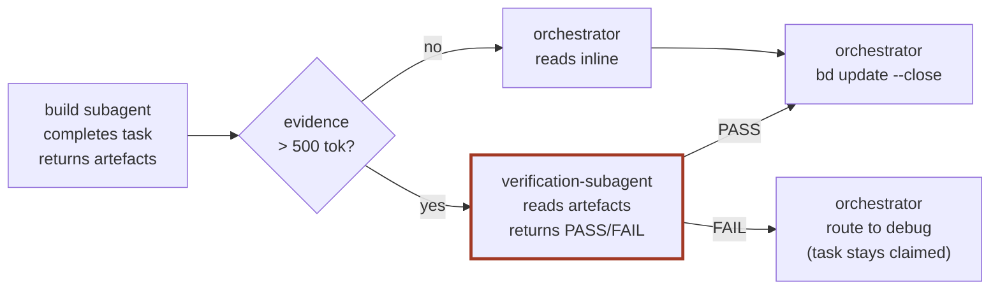

# build

Implement a plan, step-by-step, phase-by-phase. The orchestrator's claim-execute-verify-close loop, scoped to the active phase. The subagent does the actual work; the orchestrator owns context, claims, and Beads mutations.

<!-- BEGIN paperflow-thresholds -->
## Subagent enforcement (paperflow-thresholds v1)

paperflow's orchestrator delegates non-trivial work to subagents. The rule has hard thresholds and a pre-write checkpoint — not just guidance.

**Hard thresholds** — above ANY of these, the orchestrator MUST dispatch a subagent:

- **> 30 LOC** of new code (across all files in one logical unit)
- **> 50 lines** of new prose / markdown
- **> 500 tokens** of raw tool output captured / synthesised

**Bash-glue carve-out**: bash glue scripts ≤ **25 LOC** stay inline. Other languages (JS, Python, etc.) hold the 30 LOC gate.

**Pre-write checkpoint**: before any inline `Write` or `Edit` of more than 30 LOC of code OR 50 lines of prose, the orchestrator prints a one-line justification:

    Doing inline because: <reason>. Above threshold would be <subagent-reason>.

Visible self-correction, not silent inlining.

**Recursion depth = 1**: subagent briefs themselves are orchestrator-direct, no matter their length. The orchestrator can write a 600-token brief without dispatching to write the brief — otherwise infinite recursion.

**Verification-subagent dispatch**: when a subagent returns artifacts > 500 tokens of evidence (diffs, test output, screenshots), `/paperflow:build` dispatches a SECOND subagent — a verification-subagent — to inspect the evidence and confirm the gate passes. The orchestrator only sees a one-line verdict.

**Commit-message marker**: any commit touching > 30 LOC includes a structured trailer:

    Subagent-Run: <task-id>

`bin/paperflow-audit-orchestrator-budget` flags over-threshold commits that lack this trailer.

**Always orchestrator-direct (exempt list)** — never dispatch a subagent for:

- Beads bookkeeping (`bd create / claim / close / update --description`)
- Pointer-file writes (`<repo>/.paperflow/active-{goal,phase}`)
- `Read` (always free)
- Short verification commands (`curl` probes, `find … | wc -l`, single-shot greps)
- Single-line edits to live docs to bump pointers / status
- Snapshot writes that change ≤ 5 lines of an existing HTML
- `bd` comments and `bd update --description` (any size)
- Pasting verbatim subagent output (the subagent already did the work)
- Bash glue scripts ≤ 25 LOC (carve-out above)

When in doubt, dispatch.
<!-- END paperflow-thresholds -->

## Step 0 — Runtime preflight + doctor

Before doing anything else, validate that the message-carrying runtime is up and the install is healthy.

**1. Runtime probe.**

    ~/.local/bin/paperflow-preflight

Non-zero → abort the skill and paste the JSON from stdout to the user verbatim. The JSON carries `service`, `mode` (`cmux` or `launchagent`), `repair_command`, and `log_tail` — the user runs the repair, then re-invokes the skill.

**2. Doctor (deps + version + integrity).**

    ~/.local/bin/paperflow-doctor --fast

Read the JSON from stdout and react by exit code:

| Exit | Meaning | Action |
|---|---|---|
| 0 | Clean | Continue silent. |
| 1 | Warnings (outdated, optional dep missing, drift already auto-fixed) | Continue. Print a one-line summary at the start of the skill's main work: `Doctor: N warning(s) — run paperflow-doctor --full to inspect.` |
| 2 | Critical (bd/node missing, settings.json corrupted) | Abort. For each issue with `auto_fix_safe:false`, surface the `repair_command` and ask the user with `AskUserQuestion` whether to run it. |

<!-- Step 0.5 (paperflow-doc-meta) is exempt here — `/paperflow:build` claims and verifies tasks, it does not write doc HTMLs directly. -->


## File-claim discipline

Before dispatching any subagent that will Write or Edit files, the orchestrator predicts the file scope and registers a Beads claim. This catches the case where two parallel claims would touch overlapping files BEFORE either subagent starts — the OMC research (`~/docs/paperflow/notes/2026-05-10-omc-agent-coordination.html`) §9 Adopt 2 prescription.

**Per-dispatch protocol:**

1. **Predict the file scope.** Read the active task's description. If files aren't named explicitly, the brief to the subagent must instruct it to declare its target files in the first response (and pause if scope expands mid-stream).

2. **Check for conflicts:**

   ```bash
   ~/.local/bin/paperflow-claim-files check <path1> <path2> ...
   ```

   Exit 0 (`{"ok":true,"conflicts":[]}`) → no overlap, proceed. Exit 2 → JSON listing in-progress tasks holding overlapping `file-claim:<path>` labels. Abort the dispatch and surface the JSON to the user — they decide whether to wait, re-scope, or proceed knowingly.

3. **Claim the files** on the active work-task:

   ```bash
   ~/.local/bin/paperflow-claim-files claim "$TASK_ID" <path1> <path2> ...
   ```

4. **Dispatch the subagent.** Pass the file scope explicitly in the brief.

5. **On subagent return:** the labels are fine to leave for audit (they answer "which task touched which files"). Optional release for cleanliness:

   ```bash
   ~/.local/bin/paperflow-claim-files release "$TASK_ID"
   ```

6. **Close the task as usual** via `bd update $TASK_ID --close`.

In sequential mode (the paperflow default) the check will almost always pass — the discipline pays off the day someone runs two `/paperflow:build` instances in parallel against the same repo.

## When to fire

| Use this skill when | Skip when |
|---|---|
| "build" / "execute the plan" / "next step" / "ship it" | No plan exists yet — see `/paperflow:plan` |
| "next phase" / "advance phase" | No goal is active — see `/paperflow:goal` or `/paperflow:resume` |
| Plan has work-tasks ready in the active phase | All phases are closed — the goal is done |

## Process

_Section structure adapted from `obra/superpowers/skills/executing-plans` and `subagent-driven-development` (MIT) — see `THIRD-PARTY-CREDITS.md`._

The loop is small and unforgiving. Each iteration: read the active phase, ask Beads for the next ready work-task, claim it atomically, dispatch a subagent with the right scope, wait for verified return, close the task. When the active phase empties, close the phase-task and advance the active-phase pointer.

### Per-iteration steps

1. **Resolve the active goal + phase:**

   ```bash
   GOAL=$(cat <repo>/.paperflow/active-goal)
   PHASE=$(cat <repo>/.paperflow/active-phase)
   SLUG=$(bd show "$GOAL" --json | jq -r '.labels[] | select(startswith("goal-"))' | head -1)
   PHASE_NAME=$(bd show "$PHASE" --json | jq -r '.labels[] | select(startswith("phase-"))' | head -1)
   ```

2. **Ask Beads for the next ready work-task in the active phase:**

   ```bash
   bd ready --label "$SLUG" --label "$PHASE_NAME" --json | jq '.[0]'
   ```

   If empty, **advance phases** (see below). If non-empty, capture `$TASK_ID`.

3. **Atomic claim:**

   ```bash
   bd update "$TASK_ID" --claim
   ```

   If the claim fails (race with another agent), surface the error and stop. The dependency graph picks again on next invocation.

4. **Dispatch a subagent.** Subagent default: `paperflow-code-editor` for source/script tasks; pick `paperflow-doc-writer` when the task scope is HTML/CSS/Markdown only. Fall back to `general-purpose` only when the task crosses categories (e.g. needs Bash + doc writing in one shot). Brief:
   - The Task ID, title, and full description.
   - The active goal slug + the active phase name.
   - The active branch + worktree path (if `git-worktrees` mode is on).
   - The predicted file scope (declared before the file-claim check above).
   - The verification gate the subagent must pass before returning.
   - "Return only verified output. Do not summarise."

5. **Verify before closing.**

   _Subsection structure adapted from `obra/superpowers/skills/verification-before-completion` (MIT) — see `THIRD-PARTY-CREDITS.md`._

   The subagent's return must include evidence the work landed: `git diff --stat`, test output, a built artifact's path, or a screenshot. The orchestrator inspects evidence before closing the task. If evidence is missing or insufficient, dispatch a debugging-shaped subagent (see "Failure / debug").

### Verification-subagent dispatch

Verification is symmetric to writing: when the build subagent returns more than the **500-token raw-output gate** of evidence (diffs, test output, screenshots, audit reports), the orchestrator MUST dispatch a SECOND subagent — a `verification-subagent` — instead of absorbing the evidence inline.

**Brief for the verification-subagent (`subagent_type: general-purpose`):**

> Verify this evidence against this Task's acceptance gate. Return only PASS/FAIL + one-sentence reason. Reject if evidence is missing.

Inputs to the brief: the Task ID + description, the build subagent's returned artefact paths, and the verification gate the task declared at dispatch.

The orchestrator only sees the one-line verdict. `bd update <id> --close` fires only on `PASS`. `FAIL` routes to **Failure / debug** below; the build-task stays claimed.



The two-subagent flow keeps the orchestrator's context lean — the build subagent burns its context on producing the work, the verification-subagent burns its context on judging the evidence, and the orchestrator only ever holds a verdict.

6. **Close on verified completion:**

   ```bash
   bd update "$TASK_ID" --close
   ```

7. **Update statusline cache.** Re-render `~/.paperflow/statusline.txt` so the next prompt cycle reflects the new state. (Each Beads-mutating skill is responsible for the cache.)

8. **Loop.** `bd ready` again on the same phase scope.

### Advancing phases

When `bd ready --label $SLUG --label $PHASE_NAME` returns empty:

1. Confirm no claimed-but-not-closed tasks remain in the phase.
2. **Close the phase-task:** `bd update "$PHASE" --close`.
3. **Find the next phase** in canonical order (pre-flight → build → review, plus any user-defined extras): `bd list --label kind:phase --label "$SLUG" --json | jq '.[] | select(.status != "closed")' | head -1`.
4. **Update the active-phase pointers** — both the per-repo file and the per-instance scoped global:

   ```bash
   echo "$NEXT_PHASE" > <repo>/.paperflow/active-phase
   paperflow-active-scope --write phase "$NEXT_PHASE"
   ```
5. If no next phase exists, the goal is complete: surface the result and offer to close the goal-task.

6. **Surface auto-close candidates via `bd epic close-eligible`.** After advancing the active-phase pointer (or after the last phase closes), invoke:

   ```bash
   bd epic close-eligible --json
   ```

   Beads inspects every open epic and returns the ids whose dependency subtree (phases + work-tasks) is fully closed. If the active Goal id appears in the result, the orchestrator can close it directly with `bd epic close <goal-id>` — no need to walk the phase list and construct the close manually. When the Goal isn't yet eligible (claimed work-tasks remain elsewhere in the tree), the helper simply omits it; the orchestrator continues looping.

### Failure / debug

_Subsection structure adapted from `obra/superpowers/skills/systematic-debugging` (MIT) — see `THIRD-PARTY-CREDITS.md`._

When verification fails or a subagent returns errors, dispatch a debugging-shaped subagent with: the failing evidence, the active-task context, the relevant logs, and a brief telling it to find root cause before retry. The task stays claimed during debugging; close only when root cause is fixed and verification passes.

## Opt-in modes

| Mode | Trigger | What it does |
|---|---|---|
| **TDD** | "TDD this", or per-task `tdd:true` | Subagent writes failing tests first, then makes them pass. _Adapted from `obra/superpowers/skills/test-driven-development`._ |
| **Parallel agents** | "build N tasks in parallel" | Orchestrator claims N independent ready-tasks, dispatches N subagents. _Adapted from `obra/superpowers/skills/dispatching-parallel-agents`._ |
| **Worktrees** | "use a worktree" / "isolate this build" | Orchestrator creates a `git worktree add` and hands the subagent the worktree path. _Adapted from `obra/superpowers/skills/using-git-worktrees`._ |

Verification-before-completion is **always on**, not opt-in. Subagent-driven development is paperflow's **default**, not a mode.

## Artifact

- Code commits in the repo, on the active branch (or worktree).
- Beads work-tasks transitioned `closed`.
- Active-phase pointer advanced when phase empties.
- `~/.paperflow/statusline.txt` refreshed on every claim/close.

## Beads commands

| Verb | Purpose |
|---|---|
| `bd ready --label goal-<slug> --label phase-<active> --json` | Phase-scoped ready feed. |
| `bd update <id> --claim` | Atomic claim before dispatch. |
| `bd update <id> --close` | Close on verified completion. |
| `bd update <id> --reopen` | Re-open a task review rejected. |
| `bd show <id>` | Read full task context for the subagent prompt. |
| `bd update <phase-task-id> --close` | Mark phase done. |
| `bd list --label kind:phase --label goal-<slug> --json` | Find next phase. |

## Don't

- Don't skip the claim. Two agents thinking they own a task is the bug Beads atomicity prevents.
- Don't close on subagent self-report. The orchestrator inspects evidence; the subagent's "I'm done" is not enough.
- Don't cross phase boundaries silently. The active-phase pointer is the boundary; advance it explicitly.
- Don't drop into long-form work in the orchestrator. Delegate. The orchestrator's job is context, not execution.
